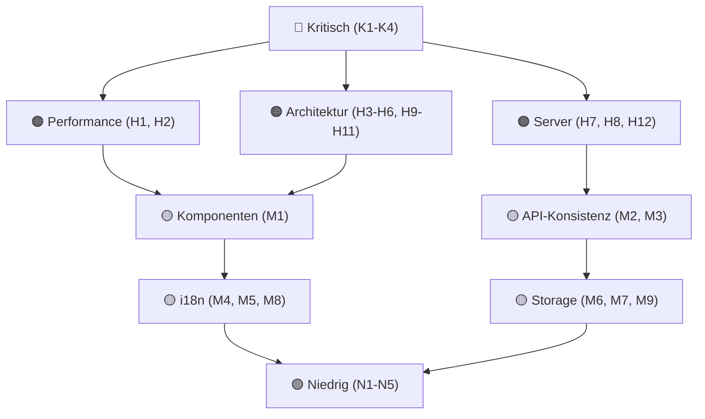

# Code Audit & Refactoring Plan [ID: PLAN-AUDIT-2026-08]

> [!IMPORTANT]
> Ergebnis einer systematischen Codebase-Analyse über alle Module hinweg.
> Erstellt am: 2026-08-16

---

## Zusammenfassung

Die Codebase hat **4 kritische**, **12 hohe**, **9 mittlere** und **5 niedrige** Probleme verteilt über:
- 🎵 MelodiQ (Musiksteuerung & TV-Sync)
- 🐺 Werewolf (Game State, Komponenten)
- 🕵️ Imposter (State Duplication, God Component)
- 🏗️ Shared Infrastructure (WebRTC, Contexts, Storage)
- 🖥️ Server (Security, Performance, API-Konsistenz)

---

## 🔴 KRITISCH (Sofort beheben)

### K1: Path Traversal Sicherheitslücke im Server
- **Datei**: [`server/src/utils/helpers.js`](file:///home/deck/Projects/LocalGameGalaxy/server/src/utils/helpers.js)
- **Problem**: `resolveSecurePath()` prüft nur `safePath.startsWith(path.normalize(dir))`. Ein Pfad wie `/home/deck/music_secret/file.txt` passiert die Validierung, wenn `/home/deck/music` ein erlaubtes Verzeichnis ist.
- **Fix**: `path.sep` an den normalisierten Verzeichnispfad anhängen bevor `startsWith` geprüft wird:
  ```js
  config.directories.some(dir => safePath.startsWith(path.normalize(dir) + path.sep))
  ```

### K2: TV-Sync Time Drift wird absichtlich deaktiviert
- **Datei**: [`src/games/melodiq/gameplay/hooks/usePassiveSync.ts`](file:///home/deck/Projects/LocalGameGalaxy/src/games/melodiq/gameplay/hooks/usePassiveSync.ts) (~L117-120)
- **Problem**: Die Bedingung `!isTVMode` verhindert, dass der TV-Modus jemals eine Zeitkorrektur durchführt. Wenn die Audio auf dem TV driftet, holt sie nie auf.
- **Fix**: `!isTVMode` aus der Bedingung entfernen, sodass der TV bei >2s Drift zum Host-Zeitpunkt springt.

### K3: Audio Playback Race Condition (Host ↔ TV)
- **Dateien**: [`MelodiqTV.tsx`](file:///home/deck/Projects/LocalGameGalaxy/src/games/melodiq/MelodiqTV.tsx) (L48-59), [`MelodiqSession.tsx`](file:///home/deck/Projects/LocalGameGalaxy/src/games/melodiq/gameplay/MelodiqSession.tsx) (L321-335)
- **Problem**: Kein synchronisierter Start. Der Host lädt → spielt sofort → sendet `PLAY_SONG` an TV. Der TV lädt dann erst → spielt mit `initialTime` aus dem originalen Payload. Da der TV Ladezeit braucht, ist der Host schon weiter → permanenter Lag.
- **Fix**: Ready-Handshake implementieren:
  1. Host + TV laden beide im pausierten Zustand
  2. Beide senden `READY` nach `canplaythrough`
  3. Host sendet `START_PLAYBACK` erst wenn beide ready sind

### K4: WebRTC Map-Mutation während Iteration
- **Datei**: [`src/lib/webrtc/WebRTCHostManager.ts`](file:///home/deck/Projects/LocalGameGalaxy/src/lib/webrtc/WebRTCHostManager.ts) (~L230, ~L380)
- **Problem**: `this.peers.delete(existingPeerId)` wird während einer `for...of`-Iteration über `this.peers.entries()` aufgerufen. Kann Elemente überspringen.
- **Fix**: Zu löschende Keys in einem Array sammeln, danach separat löschen.

---

## 🟠 HOCH (Nächste Iteration)

### H1: Cascading Re-renders durch High-Frequency State (10x/s)
- **Datei**: [`PlaybackManager.tsx`](file:///home/deck/Projects/LocalGameGalaxy/src/games/melodiq/components/PlaybackManager.tsx) (L71-76, L314-456)
- **Bereich**: MelodiQ
- **Problem**: `state.currentTime` wird alle 100ms über `setPlaybackState` gesetzt → komplettes Re-render des gesamten PlaybackManager + MelodiqSession 10x pro Sekunde.
- **Fix**: `currentTime` aus dem React-State in eine Ref auslagern. MiniPlayer über separaten Context oder `useSyncExternalStore` anbinden.

### H2: Duplizierter Broadcast-Loop
- **Datei**: [`PlaybackManager.tsx`](file:///home/deck/Projects/LocalGameGalaxy/src/games/melodiq/components/PlaybackManager.tsx) (L192-207)
- **Bereich**: MelodiQ
- **Problem**: `useScoringEngine` nutzt `requestAnimationFrame`, aber `PlaybackManager` nutzt einen separaten `setInterval(100ms)` zum Broadcasting. Zwei unsynchronisierte Loops.
- **Fix**: `setInterval` entfernen. `sendGameUpdate` direkt aus dem RAF-Loop von `useScoringEngine` (throttled) aufrufen.

### H3: Hooks als Props übergeben
- **Datei**: [`DeviceConnection.tsx`](file:///home/deck/Projects/LocalGameGalaxy/src/components/connection/DeviceConnection.tsx) (L17)
- **Bereich**: Shared
- **Problem**: `WebRTCHostContextHook` wird als Prop akzeptiert und direkt im Component-Body aufgerufen. Verstößt gegen die Rules of Hooks (Hook-Aufruf muss statisch sein).
- **Fix**: Stattdessen die aufgelösten Daten/Methoden als Props übergeben, oder ein Render-Prop/HOC-Pattern nutzen.

### H4: `useEffect` Dependency Anti-pattern
- **Datei**: [`LayoutContext.tsx`](file:///home/deck/Projects/LocalGameGalaxy/src/context/LayoutContext.tsx) (L83)
- **Bereich**: Shared
- **Problem**: Spread eines Arrays in der `useEffect` Dependency-Array: `[title, setHeader, ...items.map(i => i.label)]`. Instabil und verstößt gegen `react-hooks/exhaustive-deps`.
- **Fix**: `JSON.stringify(items)` als stabilen Vergleichswert nutzen, oder custom Deep-Compare-Hook verwenden.

### H5: `any`-Typ im gesamten Codebase
- **Dateien**:
  - [`gameReducer.ts`](file:///home/deck/Projects/LocalGameGalaxy/src/games/werewolf/logic/gameReducer.ts) (L82, L380) — `powerState: any`
  - [`WitchView.tsx`](file:///home/deck/Projects/LocalGameGalaxy/src/games/werewolf/components/WitchView.tsx) (L12) — `powerState?: any`
  - [`WebRTCHostManager.ts`](file:///home/deck/Projects/LocalGameGalaxy/src/lib/webrtc/WebRTCHostManager.ts) — `data: any`, `trackerPeer: any`
- **Fix**: Typisierte Interfaces definieren (`PlayerPowerState` als Discriminated Union; `WebRTCPayload`-Interface für Messages).

### H6: Werewolf `types.ts` – Duplizierte/Widersprüchliche Felder
- **Datei**: [`types.ts`](file:///home/deck/Projects/LocalGameGalaxy/src/games/werewolf/logic/types.ts) (L57, L65)
- **Problem**: `hasEGG` vs `hasEgg` existieren beide. `isDragonInfected` und `isInfected` sind redundant.
- **Fix**: Bereinigen: einheitliche Namensgebung, tote Felder entfernen.

### H7: Sync FS-Operationen im Server blockieren Event Loop
- **Datei**: [`server/src/controllers/songController.js`](file:///home/deck/Projects/LocalGameGalaxy/server/src/controllers/songController.js)
- **Problem**: `fs.readFileSync`, `fs.writeFileSync`, `fs.rmSync`, `fs.unlinkSync` in Request-Handlern. Blockiert den gesamten Node.js Event Loop.
- **Fix**: Alle durch `fs.promises.readFile` / `writeFile` / `rm` / `unlink` (async) ersetzen.

### H8: Hardware Back Button schließt keine Overlays
- **Datei**: [`App.tsx`](file:///home/deck/Projects/LocalGameGalaxy/src/App.tsx) (L22)
- **Bereich**: Capacitor/Android
- **Problem**: `CapacitorApp.exitApp()` wird bei Pfad `/` bedingungslos aufgerufen ohne zu prüfen, ob Modals/Dialoge offen sind.
- **Fix**: Globalen Overlay-Stack prüfen. Nur App schließen wenn kein Dialog/Modal offen ist.

### H9: Excessive Prop Drilling in Werewolf
- **Dateien**: [`WerewolfGame.tsx`](file:///home/deck/Projects/LocalGameGalaxy/src/games/werewolf/WerewolfGame.tsx) → [`NightPhase.tsx`](file:///home/deck/Projects/LocalGameGalaxy/src/games/werewolf/components/NightPhase.tsx) → Role Views
- **Problem**: `players`, `customRoles`, `round`, `dispatch` werden über 3+ Ebenen durchgereicht.
- **Fix**: `WerewolfGameContext` einführen, der `state` und `dispatch` bereitstellt.

### H10: Imposter State Duplication
- **Datei**: [`ImposterGame.tsx`](file:///home/deck/Projects/LocalGameGalaxy/src/games/imposter/ImposterGame.tsx)
- **Problem**: `players`-Array existiert doppelt – als eigenständiger State UND innerhalb von `gameState.players`.
- **Fix**: Einzige Quelle der Wahrheit definieren; abgeleiteten State via `useMemo` berechnen.

### H11: DB Seed Race Condition in React 18 Strict Mode
- **Datei**: [`ImposterGame.tsx`](file:///home/deck/Projects/LocalGameGalaxy/src/games/imposter/ImposterGame.tsx)
- **Problem**: `seedImposterDatabase()` in `useEffect` → doppelter Mount in StrictMode → konkurrierende IndexedDB-Schreibvorgänge.
- **Fix**: Idempotentes Seeding mit Check ob Daten bereits existieren, oder Initialisierung in einen Provider/Loader auslagern.

### H12: WebRTC Listener Leak
- **Datei**: [`WebRTCHostManager.ts`](file:///home/deck/Projects/LocalGameGalaxy/src/lib/webrtc/WebRTCHostManager.ts) (~L102)
- **Problem**: `this.messageListeners` ist ein unbegrenztes `Set`. Ohne sorgfältiges `off()` bei Unmount können Listener über die Lebensdauer der App leaken.
- **Fix**: Robuster Cleanup-Mechanismus beim Component-Unmount sicherstellen.

---

## 🟡 MITTEL (Geplant angehen)

### M1: God Components (>250 Zeilen, SRP-Verletzung)

| Datei | Zeilen | Verantwortlichkeiten |
|---|---|---|
| [`gameReducer.ts`](file:///home/deck/Projects/LocalGameGalaxy/src/games/werewolf/logic/gameReducer.ts) | ~537 | Monolithischer Reducer für alle Phasen |
| [`NightPhase.tsx`](file:///home/deck/Projects/LocalGameGalaxy/src/games/werewolf/components/NightPhase.tsx) | ~385 | 15 verschiedene Views in einem Switch |
| [`RoleEditor.tsx`](file:///home/deck/Projects/LocalGameGalaxy/src/games/werewolf/components/RoleEditor.tsx) | ~428 | Rollenliste + Editor + Creation Modal |
| [`GameSetup.tsx` (Werewolf)](file:///home/deck/Projects/LocalGameGalaxy/src/games/werewolf/components/GameSetup.tsx) | ~352 | Spieler + Rollen + Settings |
| [`DeviceConnection.tsx`](file:///home/deck/Projects/LocalGameGalaxy/src/components/connection/DeviceConnection.tsx) | ~375 | QR + Scanner + Peer-Liste + Settings |
| [`ImposterGame.tsx`](file:///home/deck/Projects/LocalGameGalaxy/src/games/imposter/ImposterGame.tsx) | ~270 | Routing + Timer + Setup + DB + Render |

**Fix für alle**: In Sub-Komponenten aufteilen. Logik in Custom Hooks extrahieren.

### M2: Inkonsistente Error-Response-Formate im Server
- **Dateien**: [`songController.js`](file:///home/deck/Projects/LocalGameGalaxy/server/src/controllers/songController.js), [`configController.js`](file:///home/deck/Projects/LocalGameGalaxy/server/src/controllers/configController.js)
- **Problem**: Manche Endpunkte geben `res.send('Text')`, andere `res.json({ error: '...' })` zurück.
- **Fix**: Einheitliches Error-Response-Format: immer `res.status(code).json({ error: 'message' })`.

### M3: Duplizierte Authorization-Logik
- **Dateien**: [`configController.js`](file:///home/deck/Projects/LocalGameGalaxy/server/src/controllers/configController.js), [`songController.js`](file:///home/deck/Projects/LocalGameGalaxy/server/src/controllers/songController.js)
- **Problem**: `if (!req.isMasterToken) return res.status(403).json(...)` ist 5+ Mal dupliziert.
- **Fix**: `requireMasterToken`-Middleware erstellen und in den Router einhängen.

### M4: Hardcoded Strings in MelodiQ
- **Dateien**: [`PlaybackManager.tsx`](file:///home/deck/Projects/LocalGameGalaxy/src/games/melodiq/components/PlaybackManager.tsx) (L114, 121, 137, 139, 165, 172), [`MelodiqTV.tsx`](file:///home/deck/Projects/LocalGameGalaxy/src/games/melodiq/MelodiqTV.tsx) (L126-127)
- **Problem**: Deutsche Strings wie `"Fehler: Kein lokaler Song"`, `"KI Auto-Sync gestartet..."` direkt im Code.
- **Fix**: Alle mit `t()` wrappen und i18n-Dateien aktualisieren.

### M5: Unvollständige i18n (Imposter Hints)
- **Dateien**: [`en/imposter.json`](file:///home/deck/Projects/LocalGameGalaxy/src/i18n/locales/en/imposter.json), [`de/imposter.json`](file:///home/deck/Projects/LocalGameGalaxy/src/i18n/locales/de/imposter.json)
- **Problem**: Hunderte von Dictionary-Wörtern haben leere `"hint": ""`-Werte → leere Hints in der UI.
- **Fix**: Fehlende Hints befüllen oder dynamischen Fallback implementieren.

### M6: Inkonsistente localStorage-Nutzung
- **Dateien**: [`WebRTCHostContext.tsx`](file:///home/deck/Projects/LocalGameGalaxy/src/lib/webrtc/WebRTCHostContext.tsx) (L50, 55, 111), div. Imposter-Dateien
- **Problem**: Manche Stellen nutzen die `storage`-Abstraktion aus `lib/storage.ts`, andere greifen direkt auf `localStorage` zu.
- **Fix**: Alle `localStorage.getItem/setItem`-Aufrufe durch `storage`-Lib ersetzen.

### M7: `JSON.stringify` in useEffect-Dependencies
- **Datei**: [`WebRTCHostContext.tsx`](file:///home/deck/Projects/LocalGameGalaxy/src/lib/webrtc/WebRTCHostContext.tsx) (L213)
- **Problem**: `JSON.stringify(activeTrackerUrls)` direkt in der Dependency-Array.
- **Fix**: Stabilen String `activeTrackerUrls.join(',')` verwenden oder memoisierten Wert nutzen.

### M8: String-Concatenation statt i18n-Interpolation (Werewolf)
- **Dateien**: [`DayPhase.tsx`](file:///home/deck/Projects/LocalGameGalaxy/src/games/werewolf/components/DayPhase.tsx) (L30), [`NightPhase.tsx`](file:///home/deck/Projects/LocalGameGalaxy/src/games/werewolf/components/NightPhase.tsx) (L235)
- **Problem**: `message += ' ' + t(...)` statt Template-Interpolation.
- **Fix**: `t('message_template', { names })` verwenden.

### M9: Imposter `GameSetup.tsx` – Fünffach duplizierter localStorage-Zugriff
- **Datei**: [`GameSetup.tsx` (Imposter)](file:///home/deck/Projects/LocalGameGalaxy/src/games/imposter/components/GameSetup.tsx)
- **Problem**: 5 separate `localStorage`-Zugriffe für verschiedene Settings.
- **Fix**: In einen `useGameSettings`-Hook konsolidieren.

---

## 🟢 NIEDRIG (Bei Gelegenheit)

### N1: Werewolf localStorage-Sync via useEffect statt Initializer
- **Datei**: [`WerewolfGame.tsx`](file:///home/deck/Projects/LocalGameGalaxy/src/games/werewolf/WerewolfGame.tsx) (L44-54)
- **Problem**: `useEffect` dispatched auf Mount zum Laden von Custom Roles → doppeltes Rendering.
- **Fix**: Daten direkt in der `useReducer`-Initializer-Funktion laden.

### N2: Shared Logic zwischen Spielen extrahierbar
- **Bereich**: Werewolf, Imposter
- **Problem**: Player-Listen-Management, Game-Setup-Patterns, Persistenz-Logik sind in jedem Spiel separat implementiert.
- **Fix**: Shared `usePlayerList`, `useGamePersistence`, `GameSetupLayout`-Komponente in `src/features/` oder `src/lib/` erstellen.

### N3: Remote URL Resolution blockiert Request
- **Datei**: [`server/src/controllers/mediaController.js`](file:///home/deck/Projects/LocalGameGalaxy/server/src/controllers/mediaController.js)
- **Problem**: `resolveStreamUrl` (yt-dlp) blockiert den Request bis zur Auflösung.
- **Fix**: Timeout + Caching implementieren.

### N4: i18n Fallback-Strings in Imposter
- **Datei**: [`GameInfoDialog.tsx`](file:///home/deck/Projects/LocalGameGalaxy/src/games/imposter/components/GameInfoDialog.tsx)
- **Problem**: `t('key', 'How to play')` nutzt Fallback-String, der fehlende Übersetzungen maskiert.
- **Fix**: Strikte i18n ohne Inline-Fallbacks; fehlende Keys sollen als Fehler erkennbar sein.

### N5: Keine Werewolf Host/TV-Sync
- **Bereich**: Gesamtes Werewolf-Modul
- **Problem**: Rein lokaler `useReducer`, keine Netzwerk-Synchronisation. (Vermutlich by design für hotseat, aber inkonsistent mit MelodiQ-Architektur).
- **Fix**: Falls gewünscht: WebRTC-Sync-Hook analog zu MelodiQ einbauen.

---

## Empfohlene Reihenfolge



### Sprint-Vorschlag

| Sprint | Items | Fokus |
|--------|-------|-------|
| **Sprint 1** | K1, K2, K3, K4 | Security + Sync-Bugs fixen |
| **Sprint 2** | H1, H2, H7 | Performance (Re-renders, sync FS) |
| **Sprint 3** | H3, H4, H5, H6 | TypeScript-Qualität & React-Patterns |
| **Sprint 4** | H8, H9, H10, H11, H12 | Architektur-Bereinigung |
| **Sprint 5** | M1 | God Components aufteilen |
| **Sprint 6** | M2-M9 | Konsistenz & i18n |
| **Sprint 7** | N1-N5 | Polish & Shared Logic |
