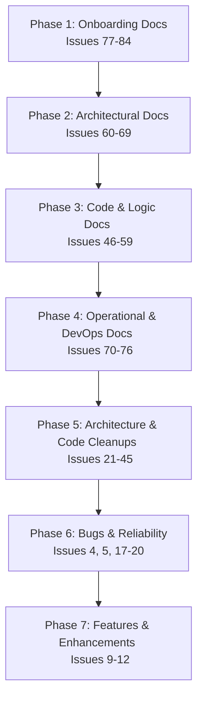

# Issues Resolution Roadmap & Implementation Plan [ID: PLAN-ROADMAP-001]

This implementation plan outlines the prioritized sequence and execution roadmap for all 73 open issues in the `suitably/LocalGameGalaxy` repository. The roadmap is structured into 7 sequential phases, beginning with the documentation update to align the project's single source of truth, followed by structural cleanups, bug fixes, and feature additions.

---

## 1. Roadmap Overview

We will execute the issues in the following 7 phases:

---

## Phase 1: Onboarding Documentation (Issues #77 to #84)
*Goal: Fix security risks in configuration management, document local setup steps, and enforce style guides for new developers.*

1. **#81 [HIGH] Security Risk: Root config.json Committed to Git Lacks Git-Ignore Protection and Secrets Guide**
   - *Action*: Untrack `config.json` via `git rm --cached`, add to `.gitignore`, create `config.example.json` with placeholders, and document secret management.
2. **#77 [HIGH] Incomplete Top-Level README and Missing Local Development Setup Guide**
   - *Action*: Replace default Vite README with an architecture overview, local setup steps (`npm install`, `npm run dev`, `npm run tracker`), prerequisites (Node, Python, Android), and configuration references.
3. **#79 [HIGH] Missing Testing Guide and Standardized Local Test Suite Configuration**
   - *Action*: Define unit, widget, and integration testing frameworks, document execution commands, and establish standards for mock generation.
4. **#82 [MEDIUM] Missing Code Formatting Configuration (Prettier / EditorConfig) and TypeScript Styling Guidelines**
   - *Action*: Add standard `.prettierrc` and `.editorconfig` configurations, configure ESLint integration, and document code styling guidelines.
5. **#80 [MEDIUM] Missing Developer Onboarding FAQ and Local Development Troubleshooting Guide**
   - *Action*: Document common installation pitfalls (e.g., Python dependencies for audio separation, WebRTC network configurations, and emulator ports).
6. **#78 [MEDIUM] Missing Contribution Guidelines (CONTRIBUTING.md) for Collaborative Development Workflows**
   - *Action*: Author `CONTRIBUTING.md` defining branch names, commit messages, PR reviews, and local verification rules.
7. **#83 [LOW] Language Inconsistency: Local Dev-Server docker-compose Workflow Document is Written in German**
   - *Action*: Translate the docker-compose guide in `docs/` to English for consistency across the codebase.
8. **#84 [LOW] Undocumented and Scattered Root-Level Helper and Verification Scripts**
   - *Action*: Document the purpose and usage of root-level utility scripts (e.g., `fix_align.py`, `verify_hunter.ts`, `remove_blur.py`) in an index or helper guide.

---

## Phase 2: Architectural Documentation (Issues #60 to #69)
*Goal: Document system topology, database schemas, synchronization protocol, and technology tradeoffs.*

9. **#60 [MEDIUM] Missing Architecture Decision Record (ADR) System for Key Technology Decisions**
   - *Action*: Create `docs/adr/`, define a standard Markdown template, and write `ADR-0001` (Dexie selection) and `ADR-0002` (BitTorrent tracker signaling).
10. **#61 [HIGH] Missing C4 System Context and Container Diagrams for Multi-Device Runtime**
    - *Action*: Render Mermaid-based C4 system context and container diagrams showing React frontend, Node helper server, WebRTC signaling, and phone clients.
11. **#62 [HIGH] Missing Protocol and Schema Documentation for Cross-Device Synchronization**
    - *Action*: Detail WebRTC signaling payloads, session sync state format, and peer-to-peer message protocol.
12. **#65 [HIGH] Missing Documentation for Server Security Model, Authentication, and SSL Generation**
    - *Action*: Document communication security, local self-signed SSL certificates, and security tokens between client and server.
13. **#66 [HIGH] Missing Database and Browser Data Persistence Layer Architecture Documentation**
    - *Action*: Document local storage schemas (Dexie/IndexedDB), active session synchronization caches, and synchronization strategies.
14. **#63 [MEDIUM] Missing Documentation for Song Ingestion and Vocal Separation Pipeline**
    - *Action*: Document vocal separation flow: downloading via `yt-dlp`, separation using PyTorch/Demucs, and forced alignment.
15. **#67 [MEDIUM] Missing i18n Strategy and Translation Namespace Architecture Documentation**
    - *Action*: Document the localization architecture, naming schemas, and namespaces for English and German.
16. **#69 [MEDIUM] Missing Werewolf Game Module Architecture Documentation**
    - *Action*: Map the state machine, reducer flow, custom role configurations, and text-to-speech integration.
17. **#64 [LOW] Missing Deployment Architecture and Multi-Platform Packaging Documentation**
    - *Action*: Map deployment models: static web server, local companion runner, and Capacitor Android package.
18. **#68 [LOW] Missing Styling, Theme, and Multi-Device Layout Architecture Documentation**
    - *Action*: Document the responsive design guidelines, dark mode tokens, and Capacitor safe area styles.

---

## Phase 3: Code Component & Logic Documentation (Issues #46 to #59)
*Goal: Write developer guides and JSDoc annotations for crucial components, custom hooks, and engines.*

19. **#46 [HIGH] Missing WebRTC Connection and Signaling Documentation**
    - *Action*: Document signaling mechanisms, peer discovery, connection establishment, and retry procedures.
20. **#48 [HIGH] Undocumented UltraStar TXT Lyric & Duet Parser**
    - *Action*: Document UltraStar text format parsing rules, line-by-line notes, and duet part separations.
21. **#49 [HIGH] Undocumented Real-Time Pitch Matching and Scoring Engine**
    - *Action*: Document audio frequency translation, note comparison math, and score calculations.
22. **#51 [HIGH] Undocumented Werewolf Game State Reducer & Win Conditions Logic**
    - *Action*: Document the core Werewolf reducer, night/day transition states, and win condition logic.
23. **#53 [HIGH] Undocumented Song Download Service and Dependency Installer**
    - *Action*: Document backend scripts that run external executables (`ffmpeg`, `yt-dlp`) and verify downloads.
24. **#55 [HIGH] Undocumented WebRTC Audio Streaming and Multi-Player Runtime State Manager**
    - *Action*: Document how multi-peer audio streams are mixed, processed, and managed in memory.
25. **#47 [MEDIUM] Undocumented Custom HTML Scraper Parser for USDB Song Search**
    - *Action*: Document the USDB parser logic, regular expressions, and HTML target containers.
26. **#50 [MEDIUM] Undocumented Canvas Pitch Visualizer and Particle Physics Renderer**
    - *Action*: Document requestAnimationFrame loop, particle emitter systems, and score bubble animations.
27. **#52 [MEDIUM] Undocumented AI Audio Separation and Installation Runner**
    - *Action*: Document setup of PyTorch envs, execution models, and error handling.
28. **#54 [MEDIUM] Undocumented Web Audio API Microphone Manager and Autocorrelation Pitch Detection Utilities**
    - *Action*: Document audio buffer captures, microphone stream constraints, and autocorrelation math.
29. **#56 [MEDIUM] Undocumented Imposter Game Mode Engine, State Machine, and Category Database Seeding**
    - *Action*: Document Imposter state transitions, game setups, and word category seeding.
30. **#58 [MEDIUM] Undocumented Werewolf Custom Role Editor Component and Ability Specification Types**
    - *Action*: Document role customizer UI and the configuration schema.
31. **#57 [LOW] Redundant and Stubbed autosync.js Service File Causes Architectural Confusion**
    - *Action*: Clean up or clearly document/annotate the usage/removal of `autosync.js`.
32. **#59 [LOW] Undocumented Werewolf Gameplay Hooks: useTTS and useGameStatePersistence**
    - *Action*: Document text-to-speech queues and storage persistence hooks.

---

## Phase 4: Operational & DevOps Documentation (Issues #70 to #76)
*Goal: Author operational playbooks, monitoring setups, backup strategies, and Android releases.*

33. **#70 [HIGH] Missing Production Operations Runbook and Secret Rotation Playbook for Melodiq Server**
    - *Action*: Author runtime configurations, SSL setups, systemd scripts, and API key rotations.
34. **#72 [HIGH] Missing Operational Backup and Recovery Procedures for Server Configuration, Playlists, and Client IndexedDB States**
    - *Action*: Document database backup strategies and recovery workflows.
35. **#75 [HIGH] Missing Deployment and Operations Runbook for Standalone WebRTC Signaling Tracker**
    - *Action*: Author instructions for deploying and maintaining WebRTC trackers.
36. **#76 [HIGH] Missing Production Troubleshooting and Diagnostics Guide for Common System Failure Modes**
    - *Action*: Detail diagnostics steps for audio issues, signaling failures, and performance bottlenecks.
37. **#71 [MEDIUM] Missing Packaging, Release, and Deployment Runbook for Android (Capacitor) Builds**
    - *Action*: Document Android SDK requirements, keystores, Capacitor syncs, and Gradle releases.
38. **#73 [MEDIUM] Missing Monitoring, Alerting, and Capacity Scaling Documentation for CPU-Intensive Audio Separation and Forced Alignment Tasks**
    - *Action*: Document CPU/RAM profiles, job queues, and hardware recommendations.
39. **#74 [LOW] Missing Incident Response, Escalation Paths, and Postmortem Guidelines**
    - *Action*: Outline post-incident reports and issue escalation paths.

---

## Phase 5: Architecture & Code Cleanups (Issues #21 to #45)
*Goal: Refactor the codebase to satisfy SOLID principles, decouple modules, fix memory leaks, and stabilize React renders.*

40. **#36 [CRITICAL] Inline Fetch Calls Scattered across Game UIs Instead of Centralized API Client**
    - *Action*: Centralize all fetch logic in a typed API client with request error handling.
41. **#41 [HIGH] Unstable createManager Recreation inside React Render Cycles**
    - *Action*: Wrap connection managers inside `useRef` or static hooks to prevent disconnects on re-renders.
42. **#39 [HIGH] Bloated Router in App.tsx violates Single Responsibility Principle**
    - *Action*: Refactor routing to sub-routing files or lazy-loaded routing tables.
43. **#37 [HIGH] Scattered and Direct Browser/Capacitor Storage access lacks a Central Storage Abstraction**
    - *Action*: Build a unified storage manager that abstracts local storage and Capacitor preferences.
44. **#29 [HIGH] Direct Database Coupling in Melodiq Gameplay Session (useSessionEnd.ts)**
    - *Action*: Decouple Dexie DB logic by extracting data access patterns into repository/service layers.
45. **#27 [HIGH] Direct Database Coupling in Imposter Game Controller (ImposterGame.tsx)**
    - *Action*: Extract DB actions to a custom hook or data service.
46. **#26 [HIGH] Direct Database Coupling in Imposter Game UI (GameSetup.tsx)**
    - *Action*: Decouple data retrieval from the setup view components.
47. **#24 [HIGH] Generic Device Connection Component Coupled to Melodiq Implementation Details**
    - *Action*: Make the device connection component generic and pass game-specific props or render props.
48. **#31 [HIGH] Werewolf Custom Role Setup and Save Logic Violates the Open/Closed Principle**
    - *Action*: Implement registry pattern for game roles so new roles can be registered dynamically.
49. **#45 [MEDIUM] Database Initializer locks React state rendering and blocking main UI thread**
    - *Action*: Move database checks to a background worker or defer initialization.
50. **#44 [MEDIUM] Stale Game Over state after multiple game loops in Melodiq**
    - *Action*: Reset all gameplay states cleanly in the reducer when restarting.
51. **#43 [MEDIUM] Memory and Listener Leaks in WebRTC Signaling Tracker**
    - *Action*: Ensure all WebTorrent/WebRTC listener subscriptions are removed in cleanup functions.
52. **#40 [MEDIUM] Bloated Audio Service with Scattered State management in Melodiq**
    - *Action*: Unify Melodiq's audio playbacks into a single class with state selectors.
53. **#38 [MEDIUM] Direct Database Queries inside React Components Violates Separation of Concerns**
    - *Action*: Encapsulate queries inside custom repository hooks.
54. **#34 [MEDIUM] Missing Public API and Encapsulation for Imposter Game Module**
    - *Action*: Define index entry points, hiding internals.
55. **#33 [LOW] Missing Public API and Encapsulation for Werewolf Game Module**
    - *Action*: Refactor werewolf imports to only use public symbols.
56. **#32 [MEDIUM] Missing Public API and Encapsulation for Melodiq Game Module**
    - *Action*: Refactor melodiq imports to only expose game interfaces.
57. **#30 [MEDIUM] Hardcoded Game Routing and Selection UI violates the Open/Closed Principle**
    - *Action*: Build a dynamic game registry that configures routing.
58. **#28 [MEDIUM] Domain Logic Coupling to Database Infrastructure in Imposter dbSeeder**
    - *Action*: Separate the seeder engine from Imposter business logic.
59. **#25 [MEDIUM] Platform-Level Progressive Web App (PWA) Config Tightly Coupled to Single Game**
    - *Action*: Make PWA manifest and service workers game-agnostic.
60. **#23 [MEDIUM] Tight Coupling of Game-Specific Database Schemas in Global Database**
    - *Action*: Sub-divide the global schema or separate IndexedDB instances.
61. **#22 [MEDIUM] Tight Coupling between Global Layout Shell and Specific Game Routes**
    - *Action*: Abstract page layouts from specific routes.
62. **#21 [MEDIUM] Circular import between MelodiqSession component and usePassiveSync hook**
    - *Action*: Extract shared interfaces or context to break circularity.
63. **#35 [LOW] Lack of ESLint Module Boundary Enforcement Rules for Game Modules**
    - *Action*: Configure ESLint rules preventing cross-game import boundaries.

---

## Phase 6: Bugs & Reliability (Issues #4, #5, #17 to #20)
*Goal: Fix user-facing runtime bugs, memory leaks, and session synchronization errors.*

64. **#20 [HIGH] Conflicting Contract and State Corruption on localStorage Key melodiq_active_session**
    - *Action*: Implement versioned key contracts and validation checks when restoring sessions.
65. **#19 [HIGH] Werewolf Custom Roles Dispatched Night Actions API Mismatch**
    - *Action*: Fix night actions dispatch schema to align role structures with the server.
66. **#17 [MEDIUM] Missing Sung Segments History Synced to TV Mode rendering Empty Visual trails**
    - *Action*: Sync singing segments correctly over WebRTC peer data channels during gameplay.
67. **#18 [LOW] Client API Response Chunk Buffer Memory Leak in PhoneClientEngine**
    - *Action*: Fix response buffer collection and release unused buffers in garbage collection.
68. **#5 [No Label] Missing vocal for some songs**
    - *Action*: Fix the vocal extraction processor script logic.
69. **#4 [No Label] Store song history on phones**
    - *Action*: Persist local song history on phone client storage.

---

## Phase 7: Features & Enhancements (Issues #9 to #12)
*Goal: Implement new integrations and user-requested improvements.*

70. **#9 [Enhancement] Feature: Prevent Screen Sleep (Keep Awake Integration)**
    - *Action*: Integrate Screen Wake Lock API to prevent mobile/tablet screens from sleeping.
71. **#10 [Enhancement] Feature: Narrator Audio & Soundboard for Werewolf Game**
    - *Action*: Add narrator audio players and soundboard trigger components to the werewolf screen.
72. **#11 [Enhancement] Feature: Automated Audio Latency Calibration for Melodiq**
    - *Action*: Build a latency measurement tool utilizing beeps and microphone capturing.
73. **#12 [Enhancement] Feature: Screen Orientation Locking for TV and Phone Roles**
    - *Action*: Lock orientations (landscape for TV, portrait/landscape per phone role) via Capacitor Screen Orientation API.
