# LocalGameGalaxy GitHub Issues

Dieses Verzeichnis enthält die vorbereiteten, agenten-tauglichen GitHub-Issues für die Architektur-Bereinigung, SOLID-Refactorings und Duplikat-Konsolidierung von **LocalGameGalaxy**.

---

## 🚀 Batch 2: Deep SOLID Anti-Pattern & Duplikat-Refactoring (19 Issues)

Diese Issues basieren auf der tiefgehenden Codebase-Analyse (`src/`) und adressieren alle identifizierten SOLID-Verstöße, verbotenen Cross-Game-Imports, God Components und duplizierten Module.

### Dependency Graph & Ausführungsreihenfolge

```mermaid
graph TD
    S01["ISSUE-SOLID-01: DrawingCanvas -> shared"]
    S02["ISSUE-SOLID-02: GuessArt mailbox -> shared sync"]
    S03["ISSUE-SOLID-03: GarticPhone cross-import fix"]
    S04["ISSUE-SOLID-04: useMultiChannelSync hook"]
    S05["ISSUE-SOLID-05: GarticPhone God Component"]
    S06["ISSUE-SOLID-06: parseGameUrlParams utility"]
    S07["ISSUE-SOLID-07: useGameJoinUrl hook"]
    S08["ISSUE-SOLID-08: GuessArt turn utils"]
    S09["ISSUE-SOLID-09: window.confirm -> MUI Dialog"]
    S10["ISSUE-SOLID-10: Melodiq storage migration"]
    S11["ISSUE-SOLID-11: WebRTC/Party storage migration"]
    S12["ISSUE-SOLID-12: GarticPhone storage migration"]
    S13["ISSUE-SOLID-13: Melodiq any types"]
    S14["ISSUE-SOLID-14: Shared any types"]
    S15["ISSUE-SOLID-15: DeviceConnection God Component"]
    S16["ISSUE-SOLID-16: MelodiqSession God Component (870L)"]
    S17["ISSUE-SOLID-17: PartyLobby God Component (623L)"]
    S18["ISSUE-SOLID-18: LayoutContext God Context"]
    S19["ISSUE-SOLID-19: i18n hardcoded strings"]

    S02 --> S03
    S02 --> S04
    S06 --> S07
    S03 --> S05
    S04 --> S05
    S07 --> S05
    S12 --> S05
    S11 --> S15
    S14 --> S15
```



### Issue-Übersicht (SOLID & Duplikate)

| Nr. | Datei | Titel | Abhängigkeit | Priorität |
| :--- | :--- | :--- | :--- | :--- |
| **S01** | [`ISSUE-SOLID-01-move-drawingcanvas-to-shared-drawing-module.md`](ISSUE-SOLID-01-move-drawingcanvas-to-shared-drawing-module.md) | `[Architecture][Cross-Game] Move DrawingCanvas to shared drawing module` | Keine | **Hoch** |
| **S02** | [`ISSUE-SOLID-02-migrate-guessart-mailbox-to-shared-sync-module.md`](ISSUE-SOLID-02-migrate-guessart-mailbox-to-shared-sync-module.md) | `[Architecture][Sync] Migrate GuessArt mailboxService to shared MqttMailboxService<T>` | Keine | **Hoch** |
| **S03** | [`ISSUE-SOLID-03-eliminate-cross-game-mailboxservice-in-garticphone.md`](ISSUE-SOLID-03-eliminate-cross-game-mailboxservice-in-garticphone.md) | `[Architecture][Cross-Game] Eliminate cross-game mailboxService import in GarticPhone` | ➡️ S02 | **Hoch** |
| **S04** | [`ISSUE-SOLID-04-create-use-multichannel-sync-hook.md`](ISSUE-SOLID-04-create-use-multichannel-sync-hook.md) | `[Refactor][Sync] Create useMultiChannelSync<T> hook in src/modules/sync/` | ➡️ S02 | **Hoch** |
| **S05** | [`ISSUE-SOLID-05-decompose-garticphone-god-component.md`](ISSUE-SOLID-05-decompose-garticphone-god-component.md) | `[Refactor][SRP] Decompose GarticPhoneGame.tsx God Component` | ➡️ S03, S04, S07, S12 | **Hoch** |
| **S06** | [`ISSUE-SOLID-06-create-parse-game-url-params-utility.md`](ISSUE-SOLID-06-create-parse-game-url-params-utility.md) | `[Refactor][DRY] Create parseGameUrlParams utility in src/modules/sharing/` | Keine | **Mittel** |
| **S07** | [`ISSUE-SOLID-07-create-use-game-join-url-hook.md`](ISSUE-SOLID-07-create-use-game-join-url-hook.md) | `[Refactor][DRY] Create useGameJoinUrl<T> hook in src/modules/sharing/` | ➡️ S06 | **Mittel** |
| **S08** | [`ISSUE-SOLID-08-extract-turn-index-calculation-guessart.md`](ISSUE-SOLID-08-extract-turn-index-calculation-guessart.md) | `[Refactor][DRY] Extract turn player calculation logic in GuessArt` | Keine | **Mittel** |
| **S09** | [`ISSUE-SOLID-09-replace-window-confirm-and-prompt-with-mui-dialogs.md`](ISSUE-SOLID-09-replace-window-confirm-and-prompt-with-mui-dialogs.md) | `[UI][A11y] Replace native window.confirm and window.prompt with MUI Dialog components` | Keine | **Mittel** |
| **S10** | [`ISSUE-SOLID-10-migrate-melodiq-localstorage-to-storage-service.md`](ISSUE-SOLID-10-migrate-melodiq-localstorage-to-storage-service.md) | `[Storage][DIP] Migrate Melodiq direct localStorage/sessionStorage calls to storage.ts` | Keine | **Hoch** |
| **S11** | [`ISSUE-SOLID-11-migrate-webrtc-party-and-connection-storage-to-storage-service.md`](ISSUE-SOLID-11-migrate-webrtc-party-and-connection-storage-to-storage-service.md) | `[Storage][DIP] Migrate WebRTC, Party, Connection, and Push storage calls to storage.ts` | Keine | **Hoch** |
| **S12** | [`ISSUE-SOLID-12-migrate-garticphone-sessionstorage-to-storage-service.md`](ISSUE-SOLID-12-migrate-garticphone-sessionstorage-to-storage-service.md) | `[Storage][DIP] Migrate GarticPhone sessionStorage calls to storage.ts` | Keine | **Mittel** |
| **S13** | [`ISSUE-SOLID-13-eliminate-typescript-any-types-in-melodiq.md`](ISSUE-SOLID-13-eliminate-typescript-any-types-in-melodiq.md) | `[TypeScript][Type-Safety] Eliminate any types in Melodiq game components and engines` | Keine | **Mittel** |
| **S14** | [`ISSUE-SOLID-14-eliminate-typescript-any-types-in-shared-connection-and-party.md`](ISSUE-SOLID-14-eliminate-typescript-any-types-in-shared-connection-and-party.md) | `[TypeScript][Type-Safety] Eliminate any types in shared Connection, Party, and Imposter logic` | Keine | **Mittel** |
| **S15** | [`ISSUE-SOLID-15-decompose-deviceconnection-god-component.md`](ISSUE-SOLID-15-decompose-deviceconnection-god-component.md) | `[Refactor][SRP] Decompose DeviceConnection.tsx God Component` | ➡️ S11, S14 | **Mittel** |
| **S16** | [`ISSUE-SOLID-16-decompose-melodiqsession-god-component.md`](ISSUE-SOLID-16-decompose-melodiqsession-god-component.md) | `[Refactor][SRP] Decompose MelodiqSession.tsx (870 lines)` | Keine | **Hoch** |
| **S17** | [`ISSUE-SOLID-17-decompose-partylobby-god-component.md`](ISSUE-SOLID-17-decompose-partylobby-god-component.md) | `[Refactor][SRP] Decompose PartyLobby.tsx (623 lines)` | Keine | **Mittel** |
| **S18** | [`ISSUE-SOLID-18-split-layoutcontext-god-context.md`](ISSUE-SOLID-18-split-layoutcontext-god-context.md) | `[Refactor][Performance] Split LayoutContext.tsx God Context` | Keine | **Mittel** |
| **S19** | [`ISSUE-SOLID-19-localize-hardcoded-strings-in-connection-components.md`](ISSUE-SOLID-19-localize-hardcoded-strings-in-connection-components.md) | `[i18n][Localization] Localize hardcoded strings in DeviceConnection and ServerAdminPanel` | Keine | **Niedrig** |

---

## 📦 Batch 1: Vorherige Modularisierungs-Issues (01 bis 08)

| Nr. | Datei | Titel |
| :--- | :--- | :--- |
| **01** | [`ISSUE-01-decouple-storyteller-guessart-mailbox.md`](ISSUE-01-decouple-storyteller-guessart-mailbox.md) | `[Critical][Architecture] Decouple Storyteller from GuessArt Mailbox & Fix Broken MQTT Sync` |
| **02** | [`ISSUE-02-fix-navigation-trapping-and-double-headers.md`](ISSUE-02-fix-navigation-trapping-and-double-headers.md) | `[UX][Navigation] Fix Melodiq Hub Navigation Trapping & Eliminate Double Headers in Sudoku, Wordle, Knister, Qwixx` |
| **03** | [`ISSUE-03-adopt-shared-player-manager-imposter-werewolf-cards.md`](ISSUE-03-adopt-shared-player-manager-imposter-werewolf-cards.md) | `[Refactor][SOLID] Adopt Shared PlayerManagerCard & useLobbyPlayers in Imposter, Werewolf, and Cards` |
| **04** | [`ISSUE-04-extract-shared-session-dialogs-share-and-edit.md`](ISSUE-04-extract-shared-session-dialogs-share-and-edit.md) | `[Modularization] Extract Shared Multi-Player Session Dialogs (ShareSessionLinksDialog & EditSessionDialog)` |
| **05** | [`ISSUE-05-extract-generic-async-game-repository-and-engine.md`](ISSUE-05-extract-generic-async-game-repository-and-engine.md) | `[Modularization] Extract Generic Async Game Repository & Conflict Engine Base` |
| **06** | [`ISSUE-06-unify-global-theme-cards-and-cta-buttons.md`](ISSUE-06-unify-global-theme-cards-and-cta-buttons.md) | `[Global][Design System] Unify Theme Tokens, Card Elevation, and Standardize Primary CTA Buttons` |
| **07** | [`ISSUE-07-centralize-storage-keys-and-eliminate-raw-localstorage.md`](ISSUE-07-centralize-storage-keys-and-eliminate-raw-localstorage.md) | `[Global][Storage] Eliminate Raw LocalStorage Bypasses & Centralize Key Registry in storage.ts` |
| **08** | [`ISSUE-08-standardize-dialog-architecture-and-a11y.md`](ISSUE-08-standardize-dialog-architecture-and-a11y.md) | `[Global][A11y] Standardize Dialog Architecture (Eliminate HTML <dialog> & Native window.confirm) and Fix Missing Aria-Labels` |

---

## 🤖 Automatisches Erstellen auf GitHub

Alle Issue-Dateien verfügen über standardkonforme YAML-Frontmatter (`title`, `labels`, `assignees`).
Sobald ein GitHub Token vorliegt, können die Issues mit folgendem Skript synchronisiert werden:

```bash
GITHUB_TOKEN="ghp_dein_personal_access_token" node scripts/create_github_issues.mjs
```
