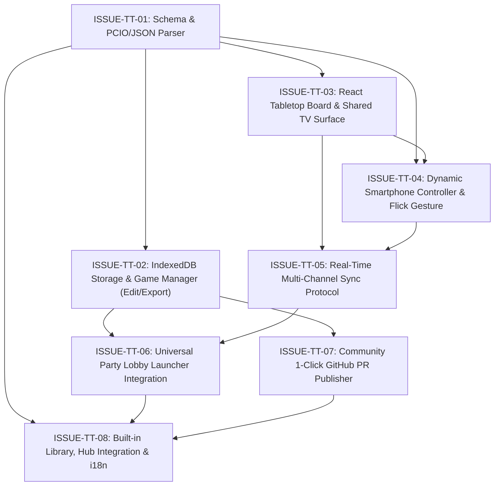

# Declarative Tabletop Engine & Community Games Library

Dieses Verzeichnis enthält die vollständigen, agenten-tauglichen GitHub-Issues zur Implementierung der **deklarativen Tabletop-Engine** mit **dynamischem Smartphone-Controller**, **TV-/Tablet-Brettansicht** und **Party-Lobby-Integration** in **LocalGameGalaxy**.

---

## 🎯 Vision & Kernarchitektur

Analog zu den UltraStar-Dateien in *Melodiq* und den Wortkatalogen in *GuessArt* erhält LocalGameGalaxy eine universelle, schema-gesteuerte Tabletop-Engine:

1. **Offenes deklaratives Format (PlayingCards.io / PCIO / JSON)**:
   - Spiele werden als JSON oder `.pcio` (ZIP) definiert (Karten, Decks, Halterungen, Marker, Würfel).
   - Jedes Spiel definiert seine `supportedModes`: `party_multi_device`, `local_pass_and_play`, `solo`.
2. **Dynamischer Smartphone-Controller (Jackbox- / Wii-U-Prinzip)**:
   - **Auf dem TV / Tablet**: Das gemeinsame Spielbrett in voller Größe (Kartenhände der Mitspieler verdeckt).
   - **Auf dem Smartphone**: Dynamisch generierter Controller (eigene Handkarten offen, Flick-to-TV-Wischgeste, Zieh-Buttons, Würfel-Buttons).
   - **Kein Spezial-Code pro Spiel**: Der Controller baut sich aus den Widget-Rollen im JSON vollautomatisch auf!
   - Umschalter auf dem Smartphone: `[ 🃏 Nur Handkarten | 🗺️ Touch-Brett ]`.
3. **Universeller Party-Lobby-Launcher (`PartyLobby.tsx` / `universalPartyManager.ts`)**:
   - Host wählt in der Party-Lobby das Spiel aus (Gartic Phone, GuessArt oder jedes Tabletop-Spiel).
   - Alle verbundenen Smartphones springen synchron mit.
   - 1-Klick auf *„Zurück zur Party-Lobby“* bringt die Gruppe nach der Runde wieder geschlossen zusammen.
4. **Offline- & Couch-Modus (Hauptmenü / Hub)**:
   - Spiele mit `local_pass_and_play` oder `solo` können auch direkt offline ohne Raum und ohne Internet an 1 Gerät gestartet werden.
5. **Vollwertige Spieleverwaltung (Edit, Export, Publish)**:
   - **Import**: Drag & Drop von `.pcio` / `.json` in IndexedDB.
   - **Edit**: Metadaten, Spielmodi und Karten/Decks bearbeiten.
   - **Export**: 1-Klick Download als `.pcio` / `.json`.
   - **Publish**: 1-Klick Pull Request via GitHub REST API (`src/lib/github.ts`) in die offizielle Community-Bibliothek!

---

## 🗺️ Dependency Graph & Ausführungsreihenfolge



---

## 📋 Issue-Übersicht

| Nr. | Datei | Titel | Abhängigkeit | Priorität |
| :--- | :--- | :--- | :--- | :--- |
| **TT01** | [`ISSUE-TT-01-schema-and-pcio-parser.md`](ISSUE-TT-01-schema-and-pcio-parser.md) | `[Feature][Tabletop] Define TypeScript Schema with Play Modes and PCIO/JSON Parser` | Keine | **Hoch** |
| **TT02** | [`ISSUE-TT-02-indexeddb-storage-and-custom-games-manager.md`](ISSUE-TT-02-indexeddb-storage-and-custom-games-manager.md) | `[Feature][Tabletop] IndexedDB Storage, Manager, Edit & Export Pipelines` | ➡️ TT01 | **Hoch** |
| **TT03** | [`ISSUE-TT-03-react-tabletop-board-and-widgets.md`](ISSUE-TT-03-react-tabletop-board-and-widgets.md) | `[Feature][Tabletop] Build Shared Tabletop Surface and Core Widget Renderers` | ➡️ TT01 | **Hoch** |
| **TT04** | [`ISSUE-TT-04-dynamic-smartphone-controller-and-hand-dock.md`](ISSUE-TT-04-dynamic-smartphone-controller-and-hand-dock.md) | `[Feature][Tabletop] Dynamic Schema-Driven Smartphone Controller & Flick-to-TV Gesture` | ➡️ TT01, TT03 | **Hoch** |
| **TT05** | [`ISSUE-TT-05-realtime-peer-sync.md`](ISSUE-TT-05-realtime-peer-sync.md) | `[Feature][Tabletop] Real-Time Multi-Device Sync Protocol via useMultiChannelSync` | ➡️ TT03, TT04 | **Hoch** |
| **TT06** | [`ISSUE-TT-06-universal-party-lobby-integration.md`](ISSUE-TT-06-universal-party-lobby-integration.md) | `[Feature][Tabletop] Integrate Universal Party Lobby Launcher for Tabletop Games` | ➡️ TT02, TT05 | **Hoch** |
| **TT07** | [`ISSUE-TT-07-github-pr-publishing-pipeline.md`](ISSUE-TT-07-github-pr-publishing-pipeline.md) | `[Feature][Tabletop] Community 1-Click GitHub PR Publishing Pipeline` | ➡️ TT02 | **Mittel** |
| **TT08** | [`ISSUE-TT-08-built-in-library-and-hub-registration.md`](ISSUE-TT-08-built-in-library-and-hub-registration.md) | `[Feature][Tabletop] Built-In Games Library, Hub Registration, and i18n` | ➡️ TT01, TT06, TT07 | **Hoch** |

---

## 🛡️ Agent Guidelines für die Umsetzung

Jeder Agent, der eines dieser Issues bearbeitet, **MUSS** folgende Projektregeln aus `AGENTS.md` und `docs/tech/architecture.md` einhalten:

1. **Anti-God-Component Budget**:
   - Maximal **250 Zeilen** pro `.tsx`-Datei.
   - Orchestrator-Komponenten < 160 Zeilen halten (Sub-Komponenten und Custom Hooks extrahieren).
2. **Keine Cross-Game Imports**:
   - Alles unter `src/games/tabletop/` kapseln.
   - Wiederverwendung nur aus `src/modules/sync/`, `src/modules/sharing/`, `src/components/`, `src/lib/`.
3. **Verbotene Anti-Patterns (Zero-Tolerance)**:
   - Kein `any` (strikte Interfaces & Discriminated Unions).
   - Kein `localStorage` direkt (immer `src/lib/storage.ts`).
   - Keine nativen Dialoge (`window.confirm`, `window.prompt`, `alert` -> immer MUI `<Dialog>` oder `<ConfirmDialog>`).
   - Keine hardcodierten UI-Strings (immer `t('key')` mit `de` und `en`).
4. **Verifikation nach Code-Änderungen**:
   ```bash
   npm run check:architecture:diff
   npm run check:budget
   npm run lint
   npm test
   npm run build
   ```
