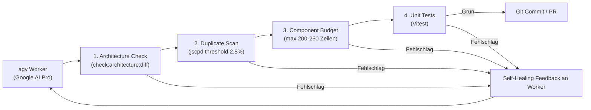

# 🏭 LocalGameGalaxy Agent Factory

Die **Agent Factory** ist eine autonome Entwicklungs-Pipeline, die mehrere **Google AI Pro Accounts** parallel als Worker-Pool bündelt und durch **strikte Qualitäts-Schranken (Quality Gates)** Code-Duplikate und Architektur-Wildwuchs verhindert.

---

## 1. Die Architektur des Worker-Pools

Um die Google AI Pro Abos ohne Token-Kosten voll auszuschöpfen, laufen 5 isolierte Worker-Profile unter dem dedizierten System-Benutzer `agentfactory`:

```
/home/agentfactory/.profiles/
├── worker1/  --> Google AI Pro Konto 1 (z.B. Feature-Entwickler A)
├── worker2/  --> Google AI Pro Konto 2 (z.B. Feature-Entwickler B)
├── worker3/  --> Google AI Pro Konto 3 (z.B. UI & Styling)
├── worker4/  --> Google AI Pro Konto 4 (z.B. Unittests & Bugfixes)
└── worker5/  --> Google AI Pro Konto 5 (z.B. Refactoring & QA)
```

Jedes Profil besitzt eine eigene, persistente OAuth-Session (`antigravity-oauth-token`).

---

## 2. Die 4-Stufen Quality Gates (Zero-Tolerance)

Bevor Code in den `dev`-Branch gelangen kann, muss er automatisch vier harte Schranken passieren:



1. **Architecture Boundary Check (`npm run check:architecture:diff`):**
   * Keine Cross-Game-Imports (`src/games/A` -> `src/games/B` ist verboten).
   * Kein rohes `localStorage` / `sessionStorage` (nur `src/lib/storage.ts`).
   * Keine nativen Alerts (`window.confirm()`).
2. **Duplikate-Scanner (`npm run check:duplicates` via `jscpd`):**
   * Scannt TS/TSX-Code. Bricht sofort ab, wenn Copy-Paste-Klone von mehr als 12 Zeilen erkannt werden.
3. **Component Budget Gate (`npm run check:budget`):**
   * Verhindert Monolithen (Hard Limit: 250 Zeilen pro `.tsx` Datei).
4. **Unit Tests (`npm test`):**
   * Alle 430+ Vitest-Tests müssen fehlerfrei durchlaufen.

---

## 3. Neues Spiel anlegen: Das Scaffolding-Tool

Agenten dürfen Ordner und Kernstrukturen **nicht frei erfinden**. Jedes neue Spiel muss über den Scaffolder erzeugt werden:

```bash
node scripts/scaffold-game.mjs --id=battleship --title="Schiffe versenken" --category=party
```

**Was automatisch generiert wird:**
* `src/games/<id>/gameManifest.ts` (Manifest für Auto-Discovery)
* `src/games/<id>/types.ts` (Discriminated Unions für State)
* `src/games/<id>/hooks/use<Game>State.ts` (State Management via `storage.ts`)
* `src/games/<id>/<Game>Game.tsx` (MUI-Presenter, strikt unter 150 Zeilen)
* `src/games/<id>/tests/<id>.test.ts` (Basis-Unittest)
* i18n-Einträge in `public/locales/de/translation.json` und `en/translation.json`
* Registrierung in `src/lib/gameRegistry.tsx`

---

## 4. Aufgaben autonom ausführen: Der Orchestrator

Um eine Aufgabe an die Agenten-Fabrik zu übergeben:

```bash
node scripts/agent-factory/orchestrator.mjs --task="Implementiere die 10x10 Gitter-Logik für Schiffe versenken" --game="battleship"
```

**Was der Orchestrator tut:**
1. Prüft `/tmp/agentfactory_locks/` und wählt den nächsten freien Worker (Worker 1..5).
2. Füttert den Task zusammen mit den strikten [AGENTS.md](file:///home/carsten/LocalGameGalaxy/AGENTS.md)-Regeln an `agy`.
3. Lässt die 4 Quality Gates laufen.
4. Falls Fehler auftreten: Schickt die Fehlermeldungen automatisch an `agy` zurück (*Self-Healing Loop*, bis zu 3 Versuche).
5. Bei Erfolg: Schließt den Lock und meldet Vollzug.
