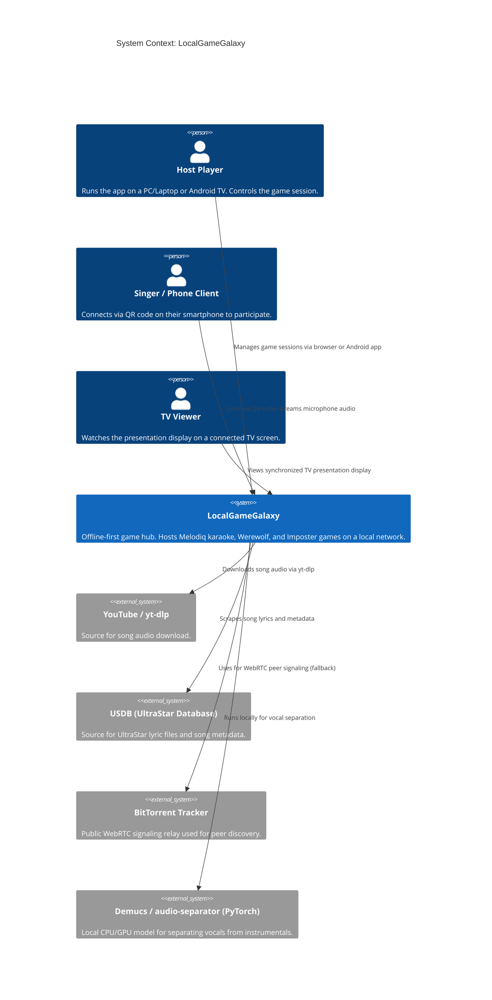
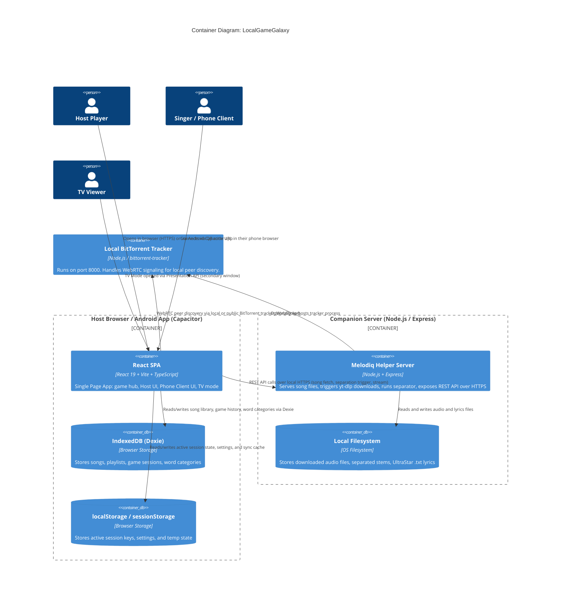
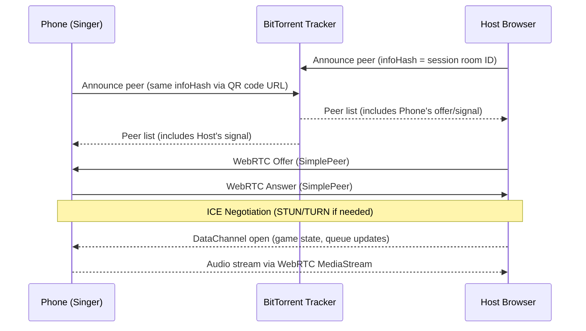

# System Context & Container Diagrams [ID: TECH-C4-DIAGRAMS]

> [!IMPORTANT]
> This document provides C4 Model context and container diagrams for the LocalGameGalaxy multi-device runtime. Update this document whenever new deployment targets or inter-service communication paths are introduced.

---

## 1. System Context Diagram

The following diagram shows LocalGameGalaxy in relation to its external actors and dependencies.

---

## 2. Container Diagram

The following diagram shows the internal containers (deployable units) that make up LocalGameGalaxy.

---

## 3. WebRTC Data Flow

The following sequence shows how a Phone Client connects to the Host during a Melodiq session.

