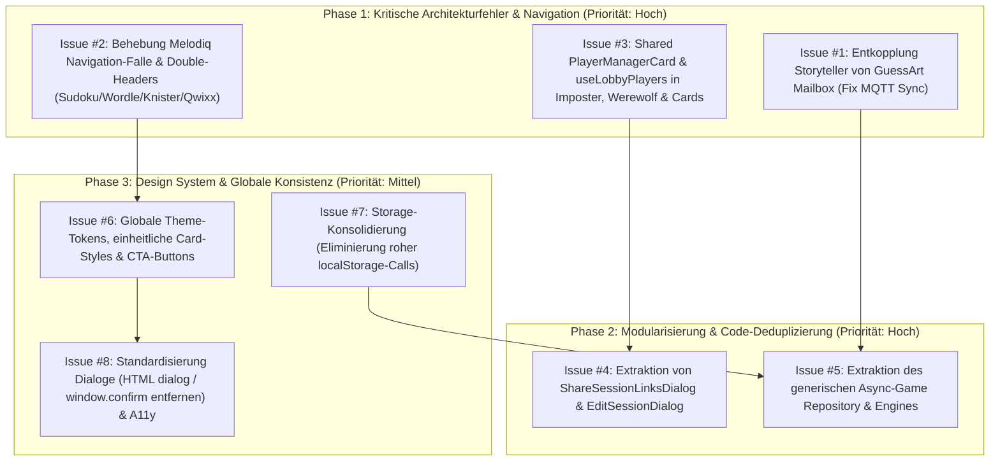

# Umfassende UI- & Logik-Modularisierungsanalyse & SOLID-Leitfaden [ID: TECH-MODULARIZATION-SOLID]

> **Status:** Analysiert & Dokumentiert  
> **Datum:** 2026-09-04  
> **Geltungsbereich:** Alle 11 Spiele in `src/games/` (`cards`, `garticphone`, `guessart`, `imposter`, `knister`, `melodiq`, `qwixx`, `storyteller`, `sudoku`, `werewolf`, `wordle`), `src/components/`, `src/modules/` und `src/theme.ts`.

---

## 1. Ausgangslage & Problemstellung

Die Codebasis von **LocalGameGalaxy** ist historisch von einem Einzelspiel (Werewolf) zu einer Plattform mit 11 Spielen gewachsen. Dabei sind zwei Hauptprobleme entstanden:

1. **Visuelle Zersplitterung (UI-Inkonsistenz):**
   Obwohl ein zentrales Material-UI Dark Theme ([`src/theme.ts`](file:///home/deck/Projects/LocalGameGalaxy/src/theme.ts)) existiert, erfindet fast jedes Spiel sein eigenes Mikro-Design-System:
   - Über **340 hardcodierte Hex-Farben** statt Theme-Tokens (z. B. Tailwind Slate/Sky in `storyteller`, Cyan/Purple in `cards`, Neon in `melodiq`).
   - Unterschiedliche Card- und Paper-Stile (7 verschiedene `borderRadius`-Werte von 4px bis 50px-Pille).
   - Unterschiedliche Start-/CTA-Buttons (Pillen-Buttons mit Farbverläufen vs. eckige Buttons vs. Theme-Standard).
   - 4 verschiedene Header-Paradigmen: Eigene Header, Double-Headers (GlobalHeader + In-Page Header gleichzeitig!), Header-Unterdrückung und Home-Button-Trapping.
   - 5 verschiedene Dialog-Konzepte: Natives HTML `<dialog>` mit manuellem DOM-Aufruf, Standard-MUI-Dialog, Dialog mit extremen `PaperProps`, Fixed-Box-Overlays mit `z-index: 9999` und blockierende native `window.confirm()`.

2. **Code-Duplikation & SOLID-Verletzungen:**
   - **Storyteller** wurde weitgehend durch Copy-Paste von **GuessArt** erstellt. Dabei entstand ein **kritischer Architekturfehler**: Storyteller importiert direkt GuessArts Mailbox-Service ([`StorytellerGame.tsx:L21`](file:///home/deck/Projects/LocalGameGalaxy/src/games/storyteller/StorytellerGame.tsx#L21)), wodurch ankommende Story-Snapshots im GuessArt-Engine-Import landen, dort eine Exception werfen und der MQTT-Sync im Storyteller fehlschlägt!
   - **Imposter** hat das Spieler-Setup-UI per Copy-Paste aus **Werewolf** übernommen ([`imposter/components/GameSetup.tsx:L126-L171`](file:///home/deck/Projects/LocalGameGalaxy/src/games/imposter/components/GameSetup.tsx#L126-L171)) und verwendet sogar noch wörtlich die deutschen Übersetzungsschlüssel von Werewolf (`games.werewolf.ui.*`).
   - 5 unabhängige QR-Code- und Link-Share-Modale mit identischer `LZString`-Kompression und Web-Share-Logik.
   - 2 identische Würfelbecher/3D-Dice-Implementierungen (`knister` vs. `qwixx`).
   - 2 identische IndexedDB-Wrapper (162 Zeilen identischer Code zwischen `guessart/logic/db.ts` und `storyteller/logic/db.ts`).
   - Fragmentierte Speicherzugriffe: Trotz Vorhandensein von [`src/lib/storage.ts`](file:///home/deck/Projects/LocalGameGalaxy/src/lib/storage.ts) mit Memory-Fallback greifen Spiele wie `sudoku`, `wordle`, `werewolf` und `melodiq` direkt über rohes `localStorage.getItem()` zu, was bei blockiertem Speicher zu Abstürzen führt.

---

## 2. SOLID-Best-Practices im React & Local-First Kontext

Um diese Duplikationen zukunftssicher aufzulösen, gelten für LocalGameGalaxy folgende SOLID-Leitlinien:

### 1. Single Responsibility Principle (SRP)
- **Container vs. Presentational:** Ein React-Komponenten-File darf nicht gleichzeitig UI-Rendering, Netzwerk/MQTT, IndexedDB-Abfragen und URL-Parsing durchführen.
  - *Negativbeispiel:* [`StorytellerGame.tsx`](file:///home/deck/Projects/LocalGameGalaxy/src/games/storyteller/StorytellerGame.tsx) (425 Zeilen: URL-Hash-Parsing, Service-Worker-Push, BroadcastChannel, MQTT-Mailbox, Header-State, Rendering).
  - *Positivbeispiel:* Trennung in `useStorytellerSession` (Hook für State & Sync) und schlanke Presentational Components (`StoryPlayView`, `StoryReaderView`).
- **Engine vs. Persistence vs. Network:** Reine Spielregeln (z. B. Punktelogik, Validierung) müssen pure TypeScript-Funktionen sein (wie `garticEngine.ts` oder `ohHellEngine.ts`), unabhängig von React oder DOM.

### 2. Open/Closed Principle (OCP)
- UI-Schalen (wie `GameSetupLayout`, `ActiveGamesSection`, `ShareSessionLinksDialog`) müssen offen für spielspezifische Erweiterungen sein, ohne den Kern zu verändern.
- Dies wird durch **Compound Components**, **Render-Slots** (`actions`, `extraFields`) und **Generics** (`<ActiveGamesList<TRecord>>`) gelöst.

### 3. Liskov Substitution Principle (LSP)
- Alle asynchronen rundenbasierten Spiele (`guessart`, `storyteller`, zukünftige Spiele) müssen die gleiche Schnittstelle für Sitzungs-CRUD bedienen können:
  ```typescript
  export interface IAsyncGameEngine<TGame, TCreateOptions> {
    createGame(options: TCreateOptions): Promise<TGame>;
    listGames(): Promise<TGame[]>;
    getGame(id: string): Promise<TGame | null>;
    deleteGame(id: string): Promise<void>;
    updateGameDetails(id: string, payload: Partial<TGame>): Promise<TGame>;
    importSnapshot(snapshot: unknown, language?: string): Promise<{ updated: boolean; game?: TGame }>;
  }
  ```
  Jede Implementierung verhält sich für die UI-Komponenten (Lobby, ActiveGamesList) identisch.

### 4. Interface Segregation Principle (ISP)
- Komponenten dürfen keine massiven Monster-Objekte verlangen, von denen sie nur 1–2 Felder nutzen.
- *Negativbeispiel:* Übergeben des gesamten `StoryGameRecord` (inkl. aller 50 Story-Einträge) an einen Chip, der nur den Titel und Status braucht.
- Verwende fokussierte Props-Interfaces oder Typ-Pickings (`Pick<StoryGameRecord, 'id' | 'name' | 'status'>`).

### 5. Dependency Inversion Principle (DIP)
- **Kritischster Punkt der Analyse:** High-Level-Module (Games) dürfen nicht von Low-Level-Details oder anderen Games abhängen!
- `storyteller` darf **niemals** direkt `src/games/guessart/logic/mailboxService.ts` importieren.
- Stattdessen wird eine generische Abstraktion `IMailboxService<T>` in `src/modules/sync/` bereitgestellt, die als Abhängigkeit injiziert oder konfiguriert wird.

---

## 3. Klassifizierung der Elemente

Die Elemente der Codebasis werden in drei Kategorien unterteilt:
1. **Globalisieren (App-weit in `src/theme.ts`, `src/components/`, `src/lib/`)**
2. **Modularisieren (Wiederverwendbare Module in `src/modules/*`)**
3. **Zusammenfassen (Deduplizieren & Konsolidieren identischer Komponenten)**

---

### A. Was muss GLOBALISIERT werden? (App-weite Standards)

| Element | Aktueller Zustand | Ziel-Architektur (Global) |
| :--- | :--- | :--- |
| **Theme Typography & Headings** | `src/theme.ts` definiert nur `h1`–`h3`. Jedes Spiel überschreibt `h4`–`h6` ad-hoc mit eigenen `fontWeight: 800`, Abständen und Farben. | Vollständige Konfiguration von `h4`, `h5`, `h6`, `subtitle1`, `subtitle2` in `src/theme.ts` mit einheitlichem `fontWeight: 700` und responsiven Schriftgrößen. |
| **Theme Card & Paper Form** | 7 verschiedene `borderRadius`-Werte (4px, 16px, 20px, 24px, 28px, 32px, 50px). | Globale `MuiCard`- und `MuiPaper`-Komponenten-Defaults in `src/theme.ts`: `borderRadius: 16px` (`2`), dezenter Border `1px solid rgba(255, 255, 255, 0.08)`, einheitliche Elevation. |
| **Primary Launch / Start Buttons** | Cards nutzt Pillen mit Farbverläufen (`borderRadius: 50`), GuessArt nutzt `borderRadius: 3`, Storyteller nutzt flaches `#0284c7`, Werewolf nutzt `secondary`. | Ein einheitliches CTA-Button-Design: Standardisierte Form (`borderRadius: 12px` oder `theme.shape.borderRadius * 1.5`), `fontSize: '1.1rem'`, `fontWeight: 700`, Nutzung von `color="primary"`. |
| **Header- & Layout-Integration** | GuessArt/Storyteller verstecken `GlobalHeader` und bauen 250 Zeilen AppBar nach. Sudoku/Wordle/Knister/Qwixx rendern zwei Header übereinander. Melodiq fängt Home-Button ab. | **Alle** Spiele nutzen ausschließlich `GlobalHeader` über `LayoutContext`: Aktionen (Regeln, Statistik, TV, Einstellungen) werden als `menuItems` registriert (automatisch Inline auf Desktop, Overflow-Menü auf Mobile). Spielspezifische Titel (z. B. Geheimes Wort in GuessArt) nutzen `customHeaderTitle`. |
| **Storage Keys & Fallback-Schutz** | Sudoku, Wordle, Werewolf, Melodiq rufen direkt `localStorage.getItem()` auf. Schlüssel wie `galaxy_sudoku_*`, `galaxy_wordle_*` sind unregistriert. | Alle Speicherzugriffe müssen über [`src/lib/storage.ts`](file:///home/deck/Projects/LocalGameGalaxy/src/lib/storage.ts) laufen (MemoryFallback bei Private Browsing). Alle Schlüssel werden in `STORAGE_KEYS` zentral typisiert registriert. |
| **Dialog-Standard & A11y** | GuessArt nutzt ungestyltes HTML `<dialog>` via `.showModal()`. Melodiq nutzt `window.confirm()`. Fixed `<div>` mit `z-index: 9999`. | Verbot von nativem HTML `<dialog>` und `window.confirm()`. Einheitliche Nutzung von MUI `<Dialog>` mit zugänglichem Focus-Trap, Esc-Handling und i18n-Bestätigungsdialogen ([`ConfirmDialog`](file:///home/deck/Projects/LocalGameGalaxy/src/components/common/ConfirmDialog.tsx)). |
| **Empty States** | Teilweise stummes Verschwinden (`null`), teilweise einfacher Text, teilweise reichhaltige Grafiken. | Einheitliche Komponente [`src/components/feedback/EmptyState.tsx`](file:///home/deck/Projects/LocalGameGalaxy/src/components/feedback/EmptyState.tsx) mit Icon, Titel, Beschreibung und Action-Button. |
| **Mobile Viewport Einheiten** | Melodiq nutzt `height: '100vh'` (führt zum Abschneiden durch mobile Browserleisten). | Standardisierung auf `100dvh` (Dynamic Viewport Height) bzw. Flex-Layouts gem. AGENTS.md Android-Capacitor-Richtlinie. |

---

### B. Was muss MODULARISIERT werden? (`src/modules/*`)

| Modul | Geplante Struktur | Zweck & Profit |
| :--- | :--- | :--- |
| **`modules/player-management`** *(Ausbau)* | Bereits begonnen. Jetzt erweitern um:<br>- `createPlayerAssignmentService(gamePrefix)`<br>- Migration von `imposter`, `werewolf`, `cards` auf `<PlayerManagerCard />` und `useLobbyPlayers`. | Beseitigt ~300 Zeilen duplizierten Code. Löst den Werewolf-i18n-Bug in Imposter. Schützt Spieler in Cards vor Datenverlust bei Refresh. Einheitliche Spieler-Verwaltung in allen Spielen. |
| **`modules/sync` (oder `src/lib/sync`)** | `MqttMailboxService<T>`:<br>- Entkoppelt von GuessArt!<br>- Generischer Message-Dispatcher mit HiveMQ/EMQX-Fallback.<br>- Listener-Registration pro Spiel/Topic. | **Behebt den kritischen Storyteller-Bug**. Ermöglicht jedem zukünftigen asynchronen Spiel (z. B. Schach, Scrabble, Schiffe versenken) sofortige Serverless-Multiplayer-Fähigkeit. |
| **`modules/sharing`** | `ShareSessionLinksDialog.tsx` & `useSessionSharing`:<br>- Generiert QR-Code mit `QRCodeSVG`<br>- Komprimiert Snapshots via `LZString`<br>- Web Share API (`navigator.share`) & Clipboard-Fallback mit 2.5s Feedback-Toast.<br>- Push-Relay-Parameter (`gameRelay`). | Beseitigt 5-fache Duplikation. Ersetzt `guessart/SharePlayerLinksDialog` (243 Zeilen), `storyteller/ShareStoryLinksDialog` (257 Zeilen), `WordleDuelModal` und Gartic-Sharing durch ein einziges, getestetes Modul. |
| **`modules/async-game`** | Basis-Klassen / Hooks für rundenbasierte Offline-First-Spiele:<br>- `createIndexedDbStore(dbName, version, stores)`<br>- `useAsyncGameLobby<TRecord, TCreateOpts>`<br>- Konfliktauflösung (`isSnapshotNewer`)<br>- `ActiveGamesList<TRecord>` (MUI-Card Liste mit Matchup, Status-Chips, Aktionen) | Beseitigt 162 Zeilen identischen IDB-Code zwischen GuessArt und Storyteller. Bringt Storyteller die gleichen praktischen Features (Spiel umbenennen, Verlauf anzeigen) wie GuessArt. |
| **`modules/drawing`** | `DrawingCanvas`, `ExcalidrawViewer`, Stroke-Animation | GarticPhone importiert heute direkt aus GuessArt. Das Auslagern nach `src/modules/drawing/` beendet die unsaubere Querabhängigkeit. |

---

### C. Was muss ZUSAMMENGEFASST werden? (Konkrete Komponenten-Deduplizierung)

1. **Player Setup Paper/Card:**
   - **Quellen:** [`werewolf/components/GameSetup.tsx:L115-L160`](file:///home/deck/Projects/LocalGameGalaxy/src/games/werewolf/components/GameSetup.tsx#L115-L160), [`imposter/components/GameSetup.tsx:L126-L171`](file:///home/deck/Projects/LocalGameGalaxy/src/games/imposter/components/GameSetup.tsx#L126-L171), [`cards/components/CardsLobby.tsx:L116-L167`](file:///home/deck/Projects/LocalGameGalaxy/src/games/cards/components/CardsLobby.tsx#L116-L167).
   - **Lösung:** Alle durch `<PlayerManagerCard />` ersetzen.

2. **Session Edit Dialog:**
   - **Quellen:** [`guessart/components/EditGameDialog.tsx`](file:///home/deck/Projects/LocalGameGalaxy/src/games/guessart/components/EditGameDialog.tsx) (279 Zeilen) und [`storyteller/components/EditStoryDialog.tsx`](file:///home/deck/Projects/LocalGameGalaxy/src/games/storyteller/components/EditStoryDialog.tsx) (99 Zeilen).
   - **Lösung:** Eine wiederverwendbare Komponente `<EditSessionDialog title={...} players={...} onSave={...} />`.

3. **Dice Roller & 3D Dice Paper:**
   - **Quellen:** [`knister/components/KnisterDiceRoller.tsx:L52-115`](file:///home/deck/Projects/LocalGameGalaxy/src/games/knister/components/KnisterDiceRoller.tsx#L52-L115) und [`qwixx/components/QwixxDiceRoller.tsx:L72-115`](file:///home/deck/Projects/LocalGameGalaxy/src/games/qwixx/components/QwixxDiceRoller.tsx#L72-L115).
   - **Lösung:** Eine universelle Würfelkomponente `src/components/games/DiceRoller.tsx` mit konfigurierbarer Würfelanzahl, Farben und Wurf-Animation.

4. **Game Setup Layout Shell:**
   - **Quellen:** Unterschiedliche Containerbreiten (`maxWidth: 600` vs `720` vs `800` vs `sm`).
   - **Lösung:** Standardisierte Wrapper-Komponente `<GameSetupContainer maxWidth="sm" | "md">`, die konsistente Abstände, Scroll-Verhalten und Sticky-Bottom-Aktionen bereitstellt.

5. **Rules / Info Dialog:**
   - **Quellen:** Unterschiedliche Implementierungen in fast jedem Spiel (HTML-Dialog, MUI-Dialog, Tables, inlined JSX).
   - **Lösung:** Standard-Komponente `<GameRulesDialog open={...} onClose={...} title={...} sections={[...]} />`.

---

## 4. Übersicht der Identifizierten GitHub Issues

Für die schrittweise, risikoarme Umsetzung werden 8 detaillierte GitHub Issues definiert:


