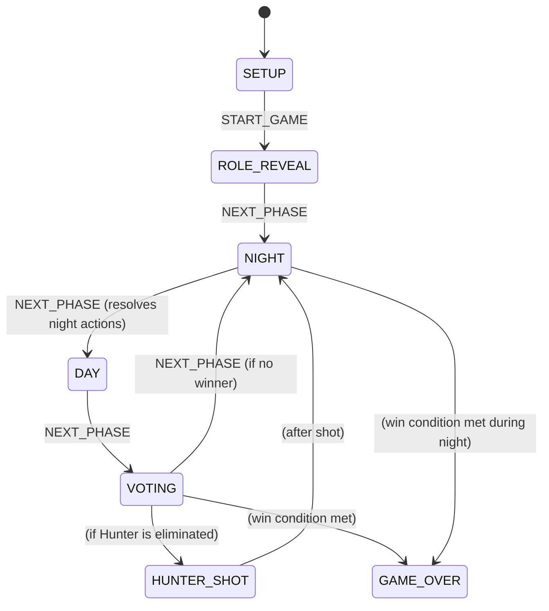

# Werewolf Game Module Architecture [ID: TECH-WEREWOLF]

> [!NOTE]
> This document covers the Werewolf game module architecture. For Melodiq, see [melodiq-architecture.md](file:///home/deck/Projects/LocalGameGalaxy/docs/tech/melodiq-architecture.md).

---

## 1. Module Overview

Werewolf is the primary game module and the oldest feature in LocalGameGalaxy. It is a fully offline, moderator-assisted social deduction game. The app serves as a **digital game master** — managing roles, narrating night phases via Text-to-Speech (TTS), and tracking win conditions automatically.

**Entry Point**: `src/games/werewolf/WerewolfGame.tsx`

---

## 2. Component Hierarchy

```
WerewolfGame.tsx              ← Root game component; provides GameContext
├── SetupScreen.tsx           ← Player management, role selection
├── RoleRevealScreen.tsx      ← Pass-device individual role reveal flow
├── NightScreen.tsx           ← Night phase UI; triggers TTS narrator
│   └── NightRoleCard.tsx     ← Per-role action card (KILL, HEAL, etc.)
├── DayScreen.tsx             ← Day discussion phase
├── VotingScreen.tsx          ← Player voting / elimination
├── HunterShotScreen.tsx      ← Special Hunter post-elimination action
├── GameOverScreen.tsx        ← Win condition display and restart
└── CustomRoleEditor.tsx      ← Role customization UI
```

---

## 3. State Management

All game state is managed by a single **Redux-pattern reducer** in `src/games/werewolf/logic/gameReducer.ts`, exposed via React Context.

### 3.1 GameState Shape

```typescript
interface GameState {
  players: Player[];           // All players with roles and alive status
  phase: GamePhase;            // Current game phase
  round: number;               // Current round counter
  nightDecisions: NightDecision[]; // Collected night actions (resolved at dawn)
  nightActionLog: string[];    // Human-readable log for moderator
  winner: WinnerFaction | null;// Set when win condition is met
  enabledRoles: Role[];        // Roles active in this game
  customRoles: RoleDefinition[]; // User-defined custom roles
  pendingHunterIds: string[];  // Hunters awaiting their shot
  nextPhaseAfterShot: GamePhase | null;
}
```

### 3.2 Game Phase Flow



### 3.3 Night Action Resolution

Night actions are **collected during the NIGHT phase** and **resolved atomically** when `NEXT_PHASE` is dispatched to move to DAY. The resolution order is:

1. Guardian / Survivor protection is applied first.
2. Werewolf KILL is applied (blocked if target is protected).
3. Witch HEAL overrides a kill. Witch KILL is applied.
4. Black Werewolf INFECT is applied.
5. Pyromaniac BURN is applied to all oiled targets.
6. Death cascade: Lovers die together, Hunter triggers `HUNTER_SHOT` phase.
7. Win conditions are evaluated after all deaths are resolved.

---

## 4. Win Condition Logic (`utils.ts`)

`getWinningFaction()` evaluates after every player death:

| Faction | Win Condition |
|---------|---------------|
| **Villagers** | All Werewolves (and Black Werewolf) are dead |
| **Werewolves** | Werewolves ≥ Villagers (by count) |
| **White Werewolf** | Only the White Werewolf remains alive |
| **Lovers** | Only the Cupid-linked lover pair remains alive |
| **Angel** | Angel is eliminated on Round 1 Day vote |
| **Ripper** | Ripper is the last player alive |
| **Survivor** | Survivor is alive when any other faction wins |
| **Pyromaniac** | All non-Pyromaniac players are burned |
| **Easter Bunny** | Easter Bunny gave an egg to every alive player |

---

## 5. Custom Role System

Custom roles are defined using the `RoleDefinition` interface:

```typescript
interface RoleDefinition {
  id: string;           // Unique ID (UUID for custom roles)
  name: string;         // Display name
  alignment: 'VILLAGER' | 'WEREWOLF' | 'NEUTRAL';
  abilities: Ability[]; // Night action definitions
  inheritsFrom?: string; // Base role ID to inherit behavior from
  isCustom: boolean;
}
```

Custom roles are persisted to `localStorage` (`werewolf_custom_roles`) and merged into `GameState.customRoles` on game start.

---

## 6. Text-to-Speech (TTS) Integration

The `useTTS` hook in `src/games/werewolf/hooks/` provides narrator voice during the night phase. It:
- Uses the Web Speech API (`window.speechSynthesis`).
- Reads `narratorText` from each role's `RoleDefinition`.
- Queues speech utterances to play sequentially as each role's turn begins.
- Respects user settings (enable/disable TTS, voice selection).

---

## 7. Development Rules for Werewolf

1. **All game logic goes in `logic/`**: Reducers, win conditions, and utility functions must be pure functions with no React or DOM dependencies — fully testable in isolation.
2. **Night actions are declarative**: Each role submits a `NightDecision` object; resolution logic is centralized in `gameReducer.ts`, not in individual role components.
3. **Custom roles inherit, not override**: New custom roles should declare `inheritsFrom` to reuse base role resolution logic and only override what's different.
