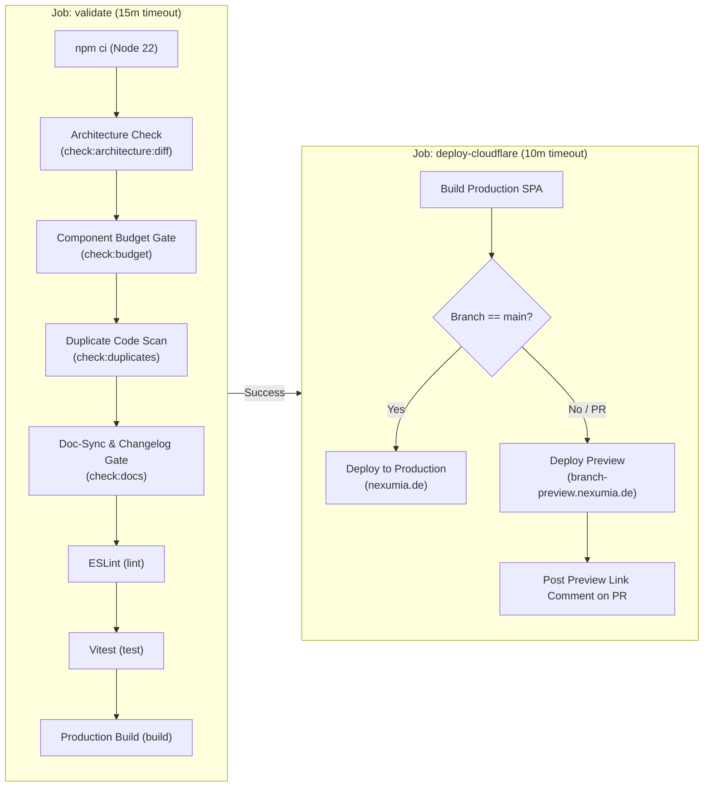
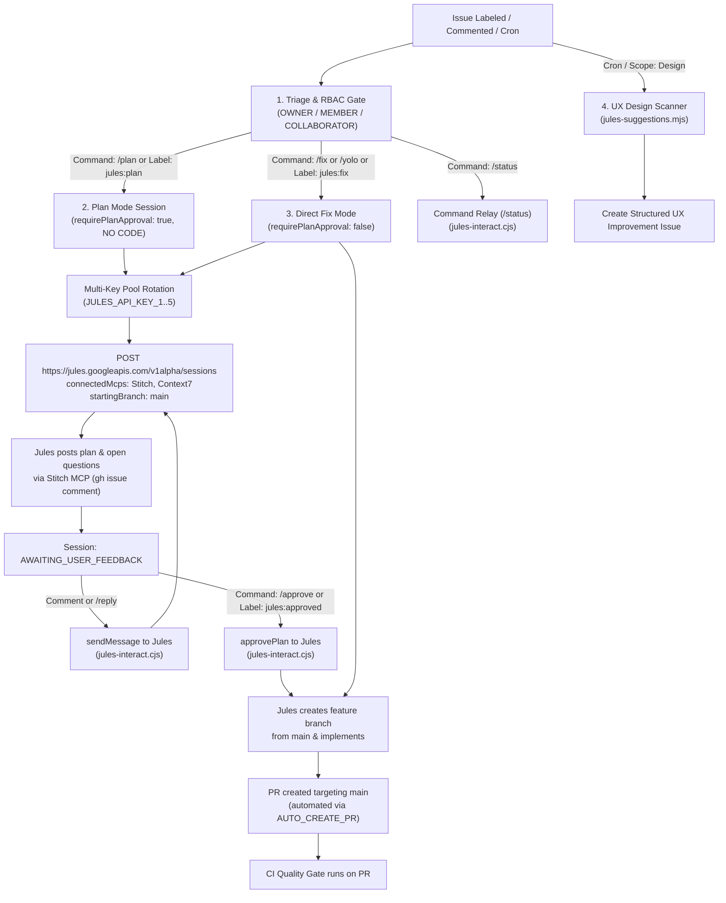
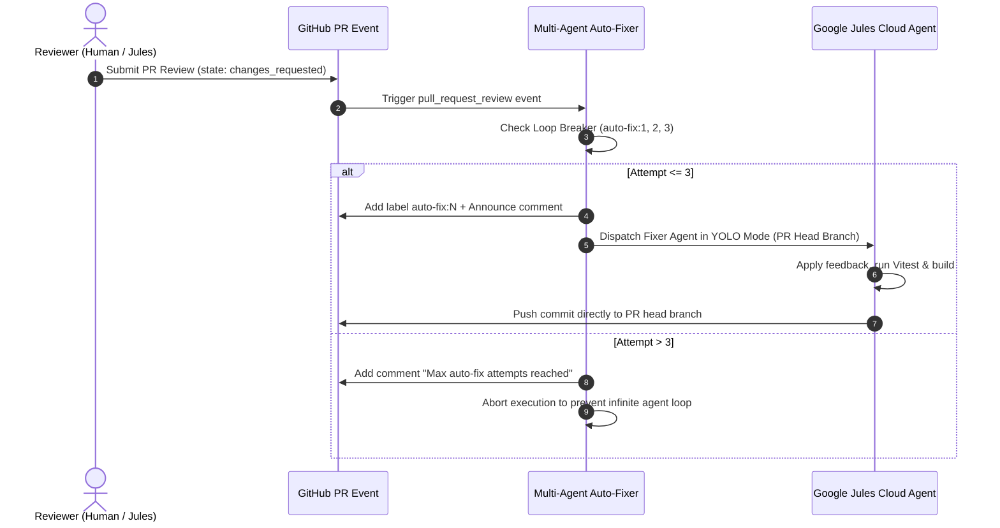

# CI/CD & Multi-Agent Pipelines Architecture

This document serves as the Single Source of Truth (SSoT) for all continuous integration, automated deployment, and autonomous multi-agent pipelines in LocalGameGalaxy.

---

## 1. High-Level Pipelines Overview

The repository operates **8 automated GitHub Actions workflows** organized into three distinct tiers:

```mermaid
flowchart TD
    subgraph CI_Deploy["Tier 1: Validation & Web Deployment"]
        CI["CI Quality Gate & Cloudflare Deploy<br/>(ci.yml)"]
        CF_Relay["Cloudflare Push Relay Deploy<br/>(deploy-push-relay.yml)"]
    end

    subgraph Releases["Tier 2: Build & Release Artifacts"]
        APK["Android APK Build<br/>(build-apk.yml)"]
        Docker["Docker Hub Dual-Target Publish<br/>(docker-publish.yml)"]
        ServerRelease["Standalone Server Binaries<br/>(release_helper.yml)"]
    end

    subgraph Autonomous["Tier 3: Multi-Agent Cloud Ecosystem"]
        JulesAgent["Jules Issue Auto-Fix Pipeline<br/>(jules-pipeline.yml)"]
        JulesReviewer["Multi-Agent PR Reviewer<br/>(jules-pr-reviewer.yml)"]
        JulesFixer["Multi-Agent PR Auto-Fixer<br/>(jules-pr-auto-fixer.yml)"]
    end

    CodePush["Git Push / PR to main"] --> CI
    RelayCode["Push to server/cloudflare-push-relay/**"] --> CF_Relay
    TagPush["Git Tag v* / Release Published"] --> APK & Docker & ServerRelease
    IssueActivity["Issue Created / Labeled / Slash Command"] --> JulesAgent
    ReviewChanges["PR Review: Changes Requested"] --> JulesFixer
    ManualPRReview["Workflow Dispatch on PR"] --> JulesReviewer
```

### Complete Pipeline Inventory

| Workflow File | Pipeline Name | Trigger(s) | Target / Output |
| :--- | :--- | :--- | :--- |
| [`.github/workflows/ci.yml`](file:///.github/workflows/ci.yml) | **CI Quality Gate** | `push` (main), `pull_request` (main) | 7 Quality Gates + Cloudflare Production / Preview Deploy |
| [`.github/workflows/cleanup-preview.yml`](file:///.github/workflows/cleanup-preview.yml) | **Cleanup Cloudflare Preview** | `pull_request` (`closed`), `workflow_dispatch` | Deletes obsolete preview branches & environments from Cloudflare |
| [`.github/workflows/build-apk.yml`](file:///.github/workflows/build-apk.yml) | **Build Android APK** | `release` (published), `push` tags (`v*`) | Compiles debug APK via Gradle & attaches `nexumia.apk` to release |
| [`.github/workflows/deploy-push-relay.yml`](file:///.github/workflows/deploy-push-relay.yml) | **Deploy Cloudflare Push Relay** | `push` (main on `server/cloudflare-push-relay/**`), `workflow_dispatch` | Deploys serverless Web Push & ntfy relay worker to Cloudflare |
| [`.github/workflows/docker-publish.yml`](file:///.github/workflows/docker-publish.yml) | **Build and Push Docker Images** | `push` (main on `server/**`), tags (`v*`), `workflow_dispatch` | Multi-target build: `base` (~200MB) and `full` (~2GB, AI Demucs) to Docker Hub |
| [`.github/workflows/release_helper.yml`](file:///.github/workflows/release_helper.yml) | **Release Nexumia Server** | `release` (published), tags (`v*`), `workflow_dispatch` | `pkg` compiles native standalone binaries (Linux, Win, macOS) with startup scripts |
| [`.github/workflows/jules-pipeline.yml`](file:///.github/workflows/jules-pipeline.yml) | **Jules Issue Auto-Fix Pipeline** | `issues (labeled)`, `issue_comment`, `workflow_dispatch` | Triage & RBAC, Google Jules REST API dispatch (Plan & Fix modes via `requirePlanApproval`), Command Relay (`jules-interact.cjs`) |
| [`.github/workflows/jules-pr-reviewer.yml`](file:///.github/workflows/jules-pr-reviewer.yml) | **Multi-Agent PR Reviewer** | `workflow_dispatch` | Matrix code review (Security & Architecture lenses) via Jules & `gh` CLI |
| [`.github/workflows/jules-pr-auto-fixer.yml`](file:///.github/workflows/jules-pr-auto-fixer.yml) | **Multi-Agent PR Auto-Fixer** | `pull_request_review` (`changes_requested`) | 3-attempt loop-breaker, autonomous YOLO fix directly committed to PR branch |

---

## 2. Pipeline Deep Dives

### 2.1 CI Quality Gate (`ci.yml`)

The primary defense line for code quality, architectural integrity, and automated frontend deployment.

#### Architecture & Stages

#### Quality Gates Explained

1. **Architecture & Boundary Check (`check:architecture:diff` / `check:architecture`)**:
   - Enforces zero cross-game imports (`src/games/<A>` cannot import from `src/games/<B>`).
   - Forbids raw `localStorage` / `sessionStorage` (mandates `src/lib/storage.ts`).
   - Forbids native blocking dialogs (`window.confirm()`, `window.prompt()`, `alert()`).
   - Blocks untyped `: any` usage.
2. **Component Size Budget Gate (`check:budget`)**:
   - Enforces max 250 lines per `.tsx` component file.
   - Ratchet mechanism: Legacy components exceeding budget are tracked in `scripts/legacy-component-baselines.json`. Any edit must decrease or preserve line count; never expand a God component.
3. **Duplicate Code Scan (`check:duplicates`)**:
   - Uses `jscpd` with `.jscpd.json` configuration.
   - Rejects PRs introducing copy-paste clones (>12 duplicate lines or >2.5% duplication threshold).
4. **Documentation & Translation Sync Gate (`check:docs`)**:
   - Executed on PRs. If core logic in `src/games/`, `src/modules/`, or `src/lib/` is modified, the PR must also update at least one of: `CHANGELOG.md`, `docs/tech/`, `AGENTS.md`, `README.md`, or `public/locales/`.
   - Bypassable for chore-only changes by adding `[skip docs]` or `[skip changelog]` in the PR description.
5. **ESLint (`npm run lint`)**: Zero errors allowed.
6. **Vitest (`npm test`)**: All unit tests must pass.
7. **Production Build (`npm run build`)**: `tsc -b && vite build` verifies zero TypeScript compiler errors and produces production bundles.

#### Cloudflare Deployment Step
- Runs after `validate` succeeds.
- Uses `cloudflare/wrangler-action@v3` with `CLOUDFLARE_API_TOKEN` and `CLOUDFLARE_ACCOUNT_ID`.
- Pushes to `main` trigger a full production release.
- Pull requests deploy an isolated preview environment, and a bot comments on the PR with `https://${sanitized-branch}.nexumia.de/`.

---

### 2.2 Cloudflare Preview Cleanup (`cleanup-preview.yml`)

Cleans up preview environments and deployments in Cloudflare once a PR is closed/merged or when manually triggered.

- **Trigger**:
  - `pull_request`: `types: [closed]` (runs on merge or PR closure).
  - `workflow_dispatch`: Manual trigger with `delete_all` option to purge all historical preview deployments.
- **Actions**:
  - Executes `scripts/cleanup-cloudflare-previews.mjs`.
  - Deletes Worker Previews (`/workers/workers/nexumia/previews/<branch>`) and legacy Pages deployments.
  - Updates the PR comment to indicate the preview environment has been cleaned up.

---

### 2.3 Android APK Packaging (`build-apk.yml`)

Automates Android package compilation whenever a new release is published or a version tag (`v*`) is pushed.

- **Environment**: Ubuntu runner, Node 22, Java 21 Zulu (`actions/setup-java@v4`).
- **Steps**:
  1. Compiles web bundle: `npm ci && npm run build`.
  2. Synchronizes native assets: `npx cap sync android`.
  3. Executes Gradle compilation: `./gradlew assembleDebug` in `android/`.
  4. Renames output binary to `nexumia.apk`.
  5. Attaches `nexumia.apk` directly to the GitHub Release via `softprops/action-gh-release@v2`.

---

### 2.4 Cloudflare Push Relay Worker (`deploy-push-relay.yml`)

Automates the deployment of the serverless push notification relay.

- **Trigger**: Pushes to `main` touching `server/cloudflare-push-relay/**` or manual `workflow_dispatch`.
- **Function**: Deploys the Cloudflare Worker located in `server/cloudflare-push-relay/` via `cloudflare/wrangler-action@v3`.
- **Security Check**: Gracefully skips deployment if `CLOUDFLARE_API_TOKEN` is not set in repository secrets.

---

### 2.5 Docker Hub Multi-Target Publishing (`docker-publish.yml`)

Builds and pushes production multi-architecture Docker container images for the companion server.

- **Trigger**: Pushes to `main` touching `server/**` (excluding `server/cloudflare-push-relay/**`), version tags (`v*`), or manual dispatch.
- **Dual-Target Strategy**:
  1. **Base Image (`target: base`)** (~200MB):
     - Lightweight Node.js runtime for standard party hosting and WebRTC signaling.
     - Published tags: `<username>/melodiq-server:latest`, `:base`, and `<username>/nexumia-server:latest`, `:base`.
     - Registry cache: `<username>/melodiq-server:buildcache-base`.
  2. **Full Image (`target: full`)** (~2GB):
     - Bundles Python, PyTorch, and Demucs AI models for offline vocal/instrumental separation.
     - Published tags: `<username>/melodiq-server:ai`, `:full`, `:melodiq`, and `<username>/nexumia-server:full`, `:melodiq`.
     - Registry cache: `<username>/melodiq-server:buildcache-full`.
- **Required Secrets**: `DOCKERHUB_USERNAME`, `DOCKERHUB_TOKEN`.

---

### 2.6 Standalone Server Packaging & Release (`release_helper.yml`)

Packages the Node.js server into zero-dependency standalone binaries for Linux, Windows, and macOS.

- **Trigger**: GitHub Release publication, version tag (`v*`), or manual dispatch.
- **Build Engine**: `pkg` run via `cd server && npm run package`.
- **Artifact Packaging**:
  - **Linux**: Bundles `nexumia-server-linux`, `start-server.sh`, and `NexumiaServer.desktop` into `nexumia-server-linux.tar.gz`.
  - **Windows**: Bundles `nexumia-server-win.exe` and `start-server.bat` into `nexumia-server-win.zip`.
  - **macOS**: Bundles `nexumia-server-macos` and `start-server.command` into `nexumia-server-macos.tar.gz`.
- **Publishing**: Automatically attaches all three archives to the GitHub Release.

---

## 3. Autonomous Multi-Agent Cloud Ecosystem

LocalGameGalaxy integrates Google Jules (cloud coding agent) and Google Gemini into a multi-agent development and quality assurance lifecycle.

### 3.1 Jules Issue Auto-Fix Pipeline (`jules-pipeline.yml`)

An event-driven orchestration pipeline enabling human maintainers to command Jules directly from GitHub Issues.

#### Key Capabilities & Architecture

1. **RBAC Security Gate**:
   - Only repository `OWNER`, `MEMBER`, or `COLLABORATOR` can invoke or interact with Jules. External issue comments are ignored to prevent unauthorized token burn or prompt injection.
2. **Multi-Key Pool & Round-Robin Load Balancing**:
   - Supports up to 5 concurrent Google Jules API keys (`JULES_API_KEY_1` to `JULES_API_KEY_5`), falling back to `JULES_API_KEY`.
   - Starting slot index is calculated via `issue_number % total_keys` to evenly distribute quota usage across keys.
   - If an API key encounters quota or rate limits, the runner seamlessly attempts the next slot in the pool.
3. **Dynamic Plan Approval (`requirePlanApproval`)**:
   - In `/plan` mode: Initiates session with `requirePlanApproval: true`. Jules analyzes the codebase and posts its proposed plan and clarifying questions via Stitch MCP without writing code or creating commits.
   - In `/fix` or `/yolo` mode: Initiates session with `requirePlanApproval: false` to implement directly without intermediate pausing.
4. **Direct REST API Invocation & Feature Branches**:
   - Connects to `https://jules.googleapis.com/v1alpha/sessions` with `automationMode: "AUTO_CREATE_PR"`.
   - Injects connected MCP servers: `["Stitch", "Context7"]`. Jules uses Stitch (`gh issue comment`) to post plans and updates directly.
   - Sets base branch to `main`. Jules isolates work in an auto-named feature branch (e.g. `jules/fix-issue-<id>`) and targets `main` for the PR.
5. **Bidirectional Command Relay (`jules-interact.cjs`)**:
   - Enables maintainers to steer running sessions from GitHub comment threads without opening the Jules web console.
   - Supported commands: `/reply <text>`, `/continue`, `/approve`, `/yolo`, `/status`.
6. **RepoLens Lens Integration (`jules-lens-resolver.mjs`)**:
   - Maintains over 350 specialized auditing lenses across Architecture, Testing, Security, and Performance.
   - Invoked via `/jules lens <lens-name>` or label `lens:<name>`.

---

### 3.2 Multi-Agent PR Reviewer (`jules-pr-reviewer.yml`)

Performs automated multi-persona code reviews on pull requests.

- **Trigger**: `workflow_dispatch` on Pull Requests.
- **Review Matrix**:
  - **Security Lens**: `domain: security`, `lens: injection` (evaluates input sanitization, XSS, command injection, path traversal).
  - **Architecture Lens**: `domain: architecture`, `lens: separation-of-concerns` (evaluates God components, SRP, storage abstraction, module boundaries).
- **Execution**: Jules runs as an auditor persona, uses `GH_TOKEN` to interact with GitHub, and submits structured reviews directly onto the PR.

---

### 3.3 Multi-Agent PR Auto-Fixer (`jules-pr-auto-fixer.yml`)

Automatically repairs Pull Requests when a human or automated reviewer requests changes.

#### Loop Breaker Mechanism
To prevent infinite agent ping-pong (Reviewer requests change $\rightarrow$ Fixer commits $\rightarrow$ Reviewer requests change), the workflow implements a strict 3-attempt circuit breaker:
- Tracks labels `auto-fix:1`, `auto-fix:2`, `auto-fix:3`.
- After 3 attempts without PR approval, the workflow automatically terminates and leaves a notification requesting human developer intervention.

---

## 4. Repository Secrets Reference

The following secrets are used across the 8 pipelines. Configure them under **GitHub Repository Settings $\rightarrow$ Secrets and variables $\rightarrow$ Actions**:

| Secret Name | Consumed By | Description | Mandatory? |
| :--- | :--- | :--- | :--- |
| `CLOUDFLARE_API_TOKEN` | `ci.yml`, `deploy-push-relay.yml` | API token with Cloudflare Pages & Workers deployment permissions | Required for web preview/prod & push relay |
| `CLOUDFLARE_ACCOUNT_ID` | `ci.yml`, `deploy-push-relay.yml` | Cloudflare Account Identifier | Required for Cloudflare deployment |
| `DOCKERHUB_USERNAME` | `docker-publish.yml` | Docker Hub account username | Required for Docker Hub image publishing |
| `DOCKERHUB_TOKEN` | `docker-publish.yml` | Docker Hub personal access token | Required for Docker Hub image publishing |
| `JULES_API_KEY` | Jules workflows | Primary Google Jules REST API key (from [jules.google.com](https://jules.google.com)) | Required for Jules agent |
| `JULES_API_KEY_1..5` | Jules workflows | Optional multi-key pool for load-balancing across accounts | Recommended for high volume |
| `GEMINI_API_KEY` | `jules-suggestions.yml` | Google AI Studio API key for scheduled UX scanner | Optional (gracefully skipped if omitted) |
| `GITHUB_TOKEN` | All workflows | Automatically provided by GitHub Actions (`secrets.GITHUB_TOKEN`) | Automatic |

---

## 5. Slash Commands & Interaction Cheatsheet

Repository maintainers (`OWNER`, `MEMBER`, `COLLABORATOR`) can control Jules workflows directly from GitHub Issue comments:

| Command | Action | Example |
| :--- | :--- | :--- |
| `/yolo` or `/jules yolo` | Run Jules in 100% autonomous mode with zero confirmation questions | `/yolo` |
| `--yolo` (flag) | Append to any command to enforce autonomous execution | `/fix --yolo` |
| `/plan` or `/jules plan` | Start Jules in Plan Mode (`requirePlanApproval: true`) to analyze and post plan via Stitch MCP without writing code | `/jules plan` |
| `/fix` or `/jules fix` | Direct fix on feature branch targeting `main` without waiting for plan approval | `/jules fix` |
| `/approve` or `/jules approve` | Approve proposed plan and trigger Jules to implement on a feature branch | `/jules approve` |
| `/reply <message>` | Send guidance, clarification, or feedback to active Jules session | `/reply Focus on mobile layout first` |
| `/continue` or `/jules continue` | Resume a paused Jules task | `/continue` |
| `/status` or `/jules status` | Fetch live session status, phase, and last activities | `/status` |
| `/jules lens <lens-id>` | Apply specialized RepoLens audit persona to the issue | `/jules lens separation-of-concerns` |
