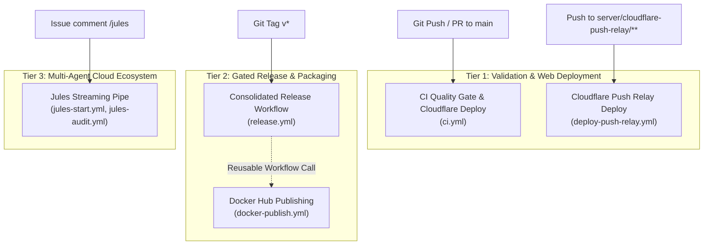
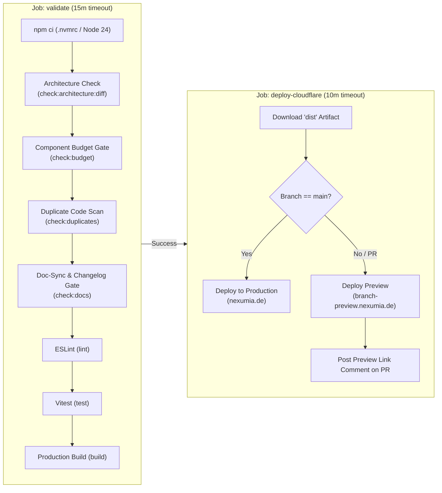
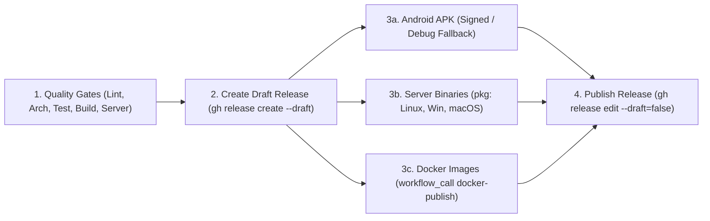

# CI/CD & Multi-Agent Pipelines Architecture

This document serves as the Single Source of Truth (SSoT) for all continuous integration, automated deployment, and autonomous multi-agent pipelines in LocalGameGalaxy.

---

## 1. High-Level Pipelines Overview

The repository operates **7 automated GitHub Actions workflows** organized into three distinct tiers:

### Complete Pipeline Inventory

| Workflow File | Pipeline Name | Trigger(s) | Target / Output |
| :--- | :--- | :--- | :--- |
| [`.github/workflows/ci.yml`](file:///.github/workflows/ci.yml) | **CI Quality Gate** | `push` (main), `pull_request` (main) | 7 Quality Gates + Cloudflare Production / Preview Deploy |
| [`.github/workflows/cleanup-preview.yml`](file:///.github/workflows/cleanup-preview.yml) | **Cleanup Cloudflare Preview** | `pull_request` (`closed`), `workflow_dispatch` | Deletes obsolete preview branches & environments from Cloudflare |
| [`.github/workflows/release.yml`](file:///.github/workflows/release.yml) | **Release (Consolidated & Gated)** | `push` tags (`v*`), `workflow_dispatch` | Gated draft release, signed Android APK, server binaries (Linux/Win/macOS), Docker publish, and auto-undraft |
| [`.github/workflows/deploy-push-relay.yml`](file:///.github/workflows/deploy-push-relay.yml) | **Deploy Cloudflare Push Relay** | `push` (main on `server/cloudflare-push-relay/**`), `workflow_dispatch` | Deploys serverless Web Push & ntfy relay worker to Cloudflare |
| [`.github/workflows/docker-publish.yml`](file:///.github/workflows/docker-publish.yml) | **Build and Push Docker Images** | `push` (main on `server/**`), `workflow_call`, `workflow_dispatch` | Multi-target build: `base` (~200MB) and `full` (~2GB, AI Demucs) to Docker Hub |
| [`.github/workflows/jules-start.yml`](file:///.github/workflows/jules-start.yml) | **Jules Start & Stream** | `issue_comment` (`/jules`), `workflow_dispatch` | Dispatches session & streams progress live to issue until PR delivery |
| [`.github/workflows/jules-audit.yml`](file:///.github/workflows/jules-audit.yml) | **Jules Scheduled Audit** | `schedule` (cron daily), `workflow_dispatch` | Runs scheduled repository audit agents defined in `.github/agents/*.md` |

---

## 2. Pipeline Deep Dives

### 2.1 CI Quality Gate (`ci.yml`)

The primary defense line for code quality, architectural integrity, and automated frontend deployment.

#### Architecture & Stages

#### Quality Gates Explained

1. **Architecture & Boundary Check (`check:architecture:diff` / `check:architecture`)**:
   - Enforces zero cross-game imports (`src/games/<A>` cannot import from `src/games/<B>`).
   - Forbids raw `localStorage` / `sessionStorage` (mandates `src/lib/storage.ts`).
   - Forbids native blocking dialogs (`window.confirm()`, `window.prompt()`, `alert()`).
   - Blocks untyped `: any` usage.
2. **Component Size Budget Gate (`check:budget`)**:
   - Enforces max 250 lines per `.tsx` component file.
   - Ratchet mechanism: Legacy components exceeding budget are tracked in `scripts/legacy-component-baselines.json`. Any edit must decrease or preserve line count; never expand a God component.
3. **Duplicate Code Scan (`check:duplicates`)**:
   - Uses `jscpd` with `.jscpd.json` configuration.
   - Rejects PRs introducing copy-paste clones (>12 duplicate lines or >2.5% duplication threshold).
4. **Documentation & Translation Sync Gate (`check:docs`)**:
   - Executed on PRs. If core logic in `src/games/`, `src/modules/`, or `src/lib/` is modified, the PR must also update at least one of: `CHANGELOG.md`, `docs/tech/`, `AGENTS.md`, `README.md`, or `public/locales/`.
   - Bypassable for chore-only changes by adding `[skip docs]` or `[skip changelog]` in the PR description.
5. **ESLint (`npm run lint`)**: Zero errors allowed.
6. **Vitest (`npm test`)**: All unit tests must pass.
7. **Production Build (`npm run build`)**: `tsc -b && vite build` verifies zero TypeScript compiler errors and produces production bundles.

#### Cloudflare Deployment Step
- Runs after `validate` succeeds.
- Uses `cloudflare/wrangler-action@v3` with `CLOUDFLARE_API_TOKEN` and `CLOUDFLARE_ACCOUNT_ID`.
- Pushes to `main` trigger a full production release.
- Pull requests deploy an isolated preview environment, and a bot comments on the PR with `https://${sanitized-branch}.nexumia.de/`.

---

### 2.2 Cloudflare Preview Cleanup (`cleanup-preview.yml`)

Cleans up preview environments and deployments in Cloudflare once a PR is closed/merged or when manually triggered.

- **Trigger**:
  - `pull_request`: `types: [closed]` (runs on merge or PR closure).
  - `workflow_dispatch`: Manual trigger with `delete_all` option to purge all historical preview deployments.
- **Actions**:
  - Executes `scripts/cleanup-cloudflare-previews.mjs`.
  - Deletes Worker Previews (`/workers/workers/nexumia/previews/<branch>`) and legacy Pages deployments.
  - Updates the PR comment to indicate the preview environment has been cleaned up.

---

### 2.3 Consolidated & Gated Release Pipeline (`release.yml`)

Consolidates Android packaging, server binary creation, Docker publishing, and release draft lifecycle into a single atomic workflow triggered on version tags (`v*`) or manual `workflow_dispatch`.

- **Execution Flow**:
  1. **`gates`**: Runs hygiene, scripts unit tests, component budget check, architecture check, ESLint, vitest frontend tests, production web build, and companion server tests. If any gate fails, no release artifacts are produced.
  2. **`create-release`**: Atomically creates a single GitHub Release in `--draft` mode with generated release notes.
  3. **Parallel artifact build**:
     - **Android APK (`build-android`)**: Compiles web bundle, runs `npx cap sync android`. If `ANDROID_KEYSTORE_BASE64` secret is configured, signs `nexumia.apk` with the production release keystore via `./gradlew assembleRelease`; otherwise falls back gracefully to `assembleDebug` with a notice. Uploads `nexumia.apk` to the draft release.
     - **Server Binaries (`build-server-binaries`)**: Runs `pkg` in `server/`, bundles Linux (`tar.gz`), Windows (`.zip`), and macOS (`tar.gz`) archives with launcher scripts, and uploads them to the draft release.
     - **Docker Publishing (`build-docker`)**: Calls the reusable `.github/workflows/docker-publish.yml` to build and push `base` and `full` images to Docker Hub.
  4. **`publish-release`**: Once all three parallel packaging jobs succeed, undrafts the release via `gh release edit "$TAG" --draft=false`. Releases never appear in half-baked or corrupted states.

---

### 2.7 Local Git Hooks & Quality Gate Lifecycle

The project divides developer validation by cost into tiered stages to ensure rapid local iteration:

1. **Pre-Commit Hook (`.husky/pre-commit`)** (< 10 s):
   - Runs `npx lint-staged` with `eslint --fix` and `prettier --write` on staged files.
   - Runs deterministic repository prechecks (`npm run check:hygiene`).
   - Runs architectural boundary diff on staged/changed files (`npm run check:architecture:diff`).
2. **Pre-Push Hook (`.husky/pre-push`)** (< 2 min):
   - Runs component size budget check (`npm run check:budget`).
   - Runs code duplication scan (`npm run check:duplicates`).
   - Runs unit test suite (`npm test`).
3. **Local Suite Shortcut (`npm run quality-gates`)**:
   - Runs the full local test and lint suite (`check:hygiene && check:architecture:diff && check:budget && check:duplicates && lint && test`).
4. **CI Server Quality Gates (`ci.yml`)**:
   - Executes deterministic prechecks, full validation, companion server tests, and Cloudflare deployment on push/PR.

---

## 3. Jules Streaming Pipeline

See [jules-pipeline-workflow.md](jules-pipeline-workflow.md). Comment `/jules` on an issue → `jules-start.yml` dispatches the task to Jules and keeps the runner active in a live polling stream, posting progress back to the issue until a PR is opened or the session completes.

---

## 4. Repository Secrets Reference

The following secrets are used across repository pipelines. Configure them under **GitHub Repository Settings $\rightarrow$ Secrets and variables $\rightarrow$ Actions**:

| Secret Name | Consumed By | Description | Mandatory? |
| :--- | :--- | :--- | :--- |
| `CLOUDFLARE_API_TOKEN` | `ci.yml`, `deploy-push-relay.yml` | API token with Cloudflare Pages & Workers deployment permissions | Required for web preview/prod & push relay |
| `CLOUDFLARE_ACCOUNT_ID` | `ci.yml`, `deploy-push-relay.yml` | Cloudflare Account Identifier | Required for Cloudflare deployment |
| `DOCKERHUB_USERNAME` | `docker-publish.yml` | Docker Hub account username | Required for Docker Hub image publishing |
| `DOCKERHUB_TOKEN` | `docker-publish.yml` | Docker Hub personal access token | Required for Docker Hub image publishing |
| `ANDROID_KEYSTORE_BASE64` | `release.yml` | Base64-encoded release `.jks` Android signing keystore | Optional (falls back to debug if absent) |
| `ANDROID_KEYSTORE_PASSWORD` | `release.yml` | Keystore password for Android release signing | Optional |
| `ANDROID_KEY_ALIAS` | `release.yml` | Key alias in Android keystore (defaults to `nexumia`) | Optional |
| `ANDROID_KEY_PASSWORD` | `release.yml` | Key password for Android release signing | Optional |
| `JULES_API_KEY` / `JULES_API_KEY_*` | `jules-start.yml`, `jules-audit.yml` | Primary Google Jules REST API key (from [jules.google.com](https://jules.google.com)) | Required for Jules agent |
| `GITHUB_TOKEN` | All workflows | Automatically provided by GitHub Actions (`secrets.GITHUB_TOKEN`) | Automatic |

---

## 5. Branch Protection & Quality Gate Ruleset

The `main` branch is protected via a repository ruleset (`.github/rulesets/main.json`):
- **Pull Request Required**: Direct pushes to `main` are restricted; code enters through reviewed and tested PRs.
- **Required Status Checks**:
  1. `Deterministic Prechecks (no install)`: Repository hygiene, actionlint, i18n parity, test:scripts.
  2. `Lint, Architecture, Budget, Test & Build`: ESLint, ratcheted architecture check, component budget, code duplicates, doc-sync, vitest, and web build.
  3. `Server Build & Tests`: Server dependency compilation and test suite.
- **Non-Fast-Forward Blocked**: Force pushes and branch deletions are disabled.

---

## 6. Slash Commands

| Command | Action |
| :--- | :--- |
| `/jules` | Start a Jules session with the issue title + body (OWNER/MEMBER/COLLABORATOR only) |
