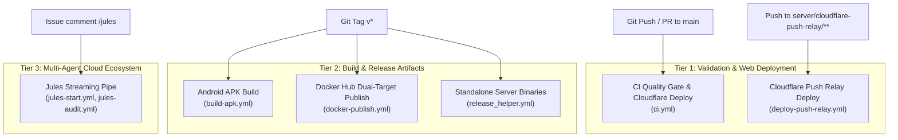
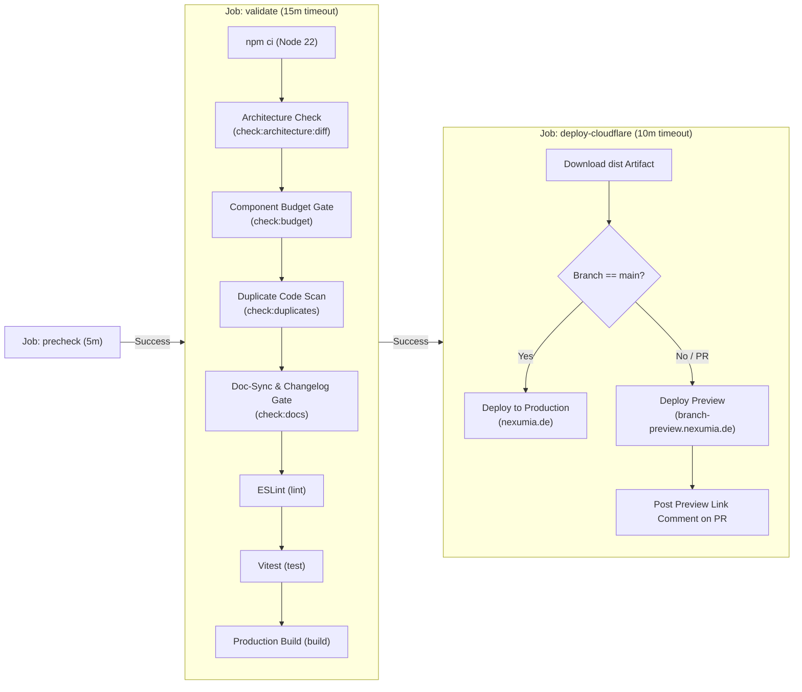

# CI/CD & Multi-Agent Pipelines Architecture

This document serves as the Single Source of Truth (SSoT) for all continuous integration, automated deployment, and autonomous multi-agent pipelines in LocalGameGalaxy.

---

## 1. High-Level Pipelines Overview

The repository operates **8 automated GitHub Actions workflows** organized into three distinct tiers:

### Complete Pipeline Inventory

| Workflow File | Pipeline Name | Trigger(s) | Target / Output |
| :--- | :--- | :--- | :--- |
| [`.github/workflows/ci.yml`](file:///.github/workflows/ci.yml) | **CI Quality Gate** | `push` (main), `pull_request` (main) | 7 Quality Gates + Cloudflare Production / Preview Deploy |
| [`.github/workflows/cleanup-preview.yml`](file:///.github/workflows/cleanup-preview.yml) | **Cleanup Cloudflare Preview** | `pull_request` (`closed`), `workflow_dispatch` | Deletes obsolete preview branches & environments from Cloudflare |
| [`.github/workflows/build-apk.yml`](file:///.github/workflows/build-apk.yml) | **Build Android APK** | `push` tags (`v*`) | Compiles debug APK via Gradle & attaches `nexumia.apk` to release |
| [`.github/workflows/deploy-push-relay.yml`](file:///.github/workflows/deploy-push-relay.yml) | **Deploy Cloudflare Push Relay** | `push` (main on `server/cloudflare-push-relay/**`), `workflow_dispatch` | Deploys serverless Web Push & ntfy relay worker to Cloudflare |
| [`.github/workflows/docker-publish.yml`](file:///.github/workflows/docker-publish.yml) | **Build and Push Docker Images** | `push` (main on `server/**`), tags (`v*`), `workflow_dispatch` | Multi-target build: `base` (~200MB) and `full` (~2GB, AI Demucs) to Docker Hub |
| [`.github/workflows/release_helper.yml`](file:///.github/workflows/release_helper.yml) | **Release Nexumia Server** | tags (`v*`), `workflow_dispatch` | `pkg` compiles native standalone binaries (Linux, Win, macOS) with startup scripts |
| [`.github/workflows/jules-start.yml`](file:///.github/workflows/jules-start.yml) | **Jules Start & Stream** | `issue_comment` (`/jules`), `workflow_dispatch` | Dispatches session & streams progress live to issue until PR delivery |
| [`.github/workflows/jules-audit.yml`](file:///.github/workflows/jules-audit.yml) | **Jules Scheduled Audit** | `schedule` (cron daily), `workflow_dispatch` | Runs scheduled repository audit agents defined in `.github/agents/*.md` |

---

## 2. Pipeline Deep Dives

### 2.1 CI Quality Gate (`ci.yml`)

The primary defense line for code quality, architectural integrity, and automated frontend deployment.

#### Architecture & Stages

#### Quality Gates Explained

1. **Architecture & Boundary Check (`check:architecture:diff` / `check:architecture`)**:
   - Enforces zero cross-game imports (`src/games/<A>` cannot import from `src/games/<B>`).
   - Forbids raw `localStorage` / `sessionStorage` (mandates `src/lib/storage.ts`).
   - Forbids native blocking dialogs (`window.confirm()`, `window.prompt()`, `alert()`).
   - Blocks untyped `: any` usage.
2. **Component Size Budget Gate (`check:budget`)**:
   - Enforces max 250 lines per `.tsx` component file.
   - Ratchet mechanism: Legacy components exceeding budget are tracked in `scripts/legacy-component-baselines.json`. Any edit must decrease or preserve line count; never expand a God component.
3. **Duplicate Code Scan (`check:duplicates`)**:
   - Uses `jscpd` with `.jscpd.json` configuration.
   - Rejects PRs introducing copy-paste clones (>12 duplicate lines or >2.5% duplication threshold).
4. **Documentation & Translation Sync Gate (`check:docs`)**:
   - Executed on PRs. If core logic in `src/games/`, `src/modules/`, or `src/lib/` is modified, the PR must also update at least one of: `CHANGELOG.md`, `docs/tech/`, `AGENTS.md`, `README.md`, or `public/locales/`.
   - Bypassable for chore-only changes by adding `[skip docs]` or `[skip changelog]` in the PR description.
5. **ESLint (`npm run lint`)**: Zero errors allowed.
6. **Vitest (`npm test`)**: All unit tests must pass.
7. **Production Build (`npm run build`)**: `tsc -b && vite build` verifies zero TypeScript compiler errors and produces production bundles.

#### Cloudflare Deployment Step
- Runs after `validate` succeeds.
- Uses `cloudflare/wrangler-action@v3` with `CLOUDFLARE_API_TOKEN` and `CLOUDFLARE_ACCOUNT_ID`.
- Pushes to `main` trigger a full production release.
- Pull requests deploy an isolated preview environment, and a bot comments on the PR with `https://${sanitized-branch}.nexumia.de/`.

---

### 2.2 Cloudflare Preview Cleanup (`cleanup-preview.yml`)

Cleans up preview environments and deployments in Cloudflare once a PR is closed/merged or when manually triggered.

- **Trigger**:
  - `pull_request`: `types: [closed]` (runs on merge or PR closure).
  - `workflow_dispatch`: Manual trigger with `delete_all` option to purge all historical preview deployments.
- **Actions**:
  - Executes `scripts/cleanup-cloudflare-previews.mjs`.
  - Deletes Worker Previews (`/workers/workers/nexumia/previews/<branch>`) and legacy Pages deployments.
  - Updates the PR comment to indicate the preview environment has been cleaned up.

---

### 2.3 Android APK Packaging (`build-apk.yml`)

Automates Android package compilation whenever a new release is published or a version tag (`v*`) is pushed.

- **Environment**: Ubuntu runner, Node 22, Java 21 Zulu (`actions/setup-java@v4`).
- **Steps**:
  1. Compiles web bundle: `npm ci && npm run build`.
  2. Synchronizes native assets: `npx cap sync android`.
  3. Executes Gradle compilation: `./gradlew assembleDebug` in `android/`.
  4. Renames output binary to `nexumia.apk`.
  5. Attaches `nexumia.apk` directly to the GitHub Release via `softprops/action-gh-release@v2`.

---

### 2.4 Cloudflare Push Relay Worker (`deploy-push-relay.yml`)

Automates the deployment of the serverless push notification relay.

- **Trigger**: Pushes to `main` touching `server/cloudflare-push-relay/**` or manual `workflow_dispatch`.
- **Function**: Deploys the Cloudflare Worker located in `server/cloudflare-push-relay/` via `cloudflare/wrangler-action@v3`.
- **Security Check**: Gracefully skips deployment if `CLOUDFLARE_API_TOKEN` is not set in repository secrets.

---

### 2.5 Docker Hub Multi-Target Publishing (`docker-publish.yml`)

Builds and pushes production multi-architecture Docker container images for the companion server.

- **Trigger**: Pushes to `main` touching `server/**` (excluding `server/cloudflare-push-relay/**`), version tags (`v*`), or manual dispatch.
- **Dual-Target Strategy**:
  1. **Base Image (`target: base`)** (~200MB):
     - Lightweight Node.js runtime for standard party hosting and WebRTC signaling.
     - Published tags: `<username>/melodiq-server:latest`, `:base`, and `<username>/nexumia-server:latest`, `:base`.
     - Registry cache: `<username>/melodiq-server:buildcache-base`.
  2. **Full Image (`target: full`)** (~2GB):
     - Bundles Python, PyTorch, and Demucs AI models for offline vocal/instrumental separation.
     - Published tags: `<username>/melodiq-server:ai`, `:full`, `:melodiq`, and `<username>/nexumia-server:full`, `:melodiq`.
     - Registry cache: `<username>/melodiq-server:buildcache-full`.
- **Required Secrets**: `DOCKERHUB_USERNAME`, `DOCKERHUB_TOKEN`.

---

### 2.6 Standalone Server Packaging & Release (`release_helper.yml`)

Packages the Node.js server into zero-dependency standalone binaries for Linux, Windows, and macOS.

- **Trigger**: GitHub Release publication, version tag (`v*`), or manual dispatch.
- **Build Engine**: `pkg` run via `cd server && npm run package`.
- **Artifact Packaging**:
  - **Linux**: Bundles `nexumia-server-linux`, `start-server.sh`, and `NexumiaServer.desktop` into `nexumia-server-linux.tar.gz`.
  - **Windows**: Bundles `nexumia-server-win.exe` and `start-server.bat` into `nexumia-server-win.zip`.
  - **macOS**: Bundles `nexumia-server-macos` and `start-server.command` into `nexumia-server-macos.tar.gz`.
- **Publishing**: Automatically attaches all three archives to the GitHub Release.

---

### 2.7 Deterministic Prechecks (`npm run check:hygiene`)

First CI job (`precheck`, no `npm ci`), also part of `quality-gates`/pre-commit. Fails on: tracked `.orig/.rej/.bak/*.diff` artifacts, merge conflict markers, invalid JSON, new de/en i18n key gaps (known gaps in `scripts/i18n-parity-baseline.json`, ratchet), focused tests (`.only`), `debugger`, secret patterns, workflows without `permissions`. Warns on missing job timeouts and files > 5 MB. `ci.yml` also uses `concurrency` (cancels superseded PR runs) and skips Cloudflare deploy for fork PRs.

---

## 3. Jules Streaming Pipeline

See [jules-pipeline-workflow.md](jules-pipeline-workflow.md). Comment `/jules` on an issue → `jules-start.yml` dispatches the task to Jules and keeps the runner active in a live polling stream, posting progress back to the issue until a PR is opened or the session completes.

---

## 4. Repository Secrets Reference

The following secrets are used across repository pipelines. Configure them under **GitHub Repository Settings $\rightarrow$ Secrets and variables $\rightarrow$ Actions**:

| Secret Name | Consumed By | Description | Mandatory? |
| :--- | :--- | :--- | :--- |
| `CLOUDFLARE_API_TOKEN` | `ci.yml`, `deploy-push-relay.yml` | API token with Cloudflare Pages & Workers deployment permissions | Required for web preview/prod & push relay |
| `CLOUDFLARE_ACCOUNT_ID` | `ci.yml`, `deploy-push-relay.yml` | Cloudflare Account Identifier | Required for Cloudflare deployment |
| `DOCKERHUB_USERNAME` | `docker-publish.yml` | Docker Hub account username | Required for Docker Hub image publishing |
| `DOCKERHUB_TOKEN` | `docker-publish.yml` | Docker Hub personal access token | Required for Docker Hub image publishing |
| `JULES_API_KEY` / `JULES_API_KEY_*` | `jules-start.yml`, `jules-audit.yml` | Primary Google Jules REST API key (from [jules.google.com](https://jules.google.com)) | Required for Jules agent |
| `GITHUB_TOKEN` | All workflows | Automatically provided by GitHub Actions (`secrets.GITHUB_TOKEN`) | Automatic |

---

## 5. Slash Commands

| Command | Action |
| :--- | :--- |
| `/jules` | Start a Jules session with the issue title + body (OWNER/MEMBER/COLLABORATOR only) |
