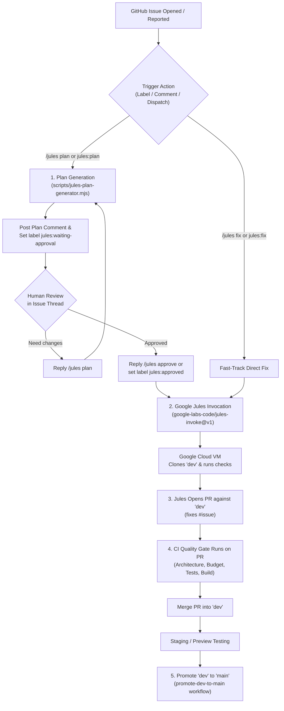

# Google Jules Issue Autofix Pipeline & Best Practice Workflow

## 1. Overview & Architecture

This workflow integrates **Google Jules** (Google Labs' autonomous cloud coding agent) into LocalGameGalaxy. It establishes a secure, human-in-the-loop (HITL) development lifecycle where GitHub issues are planned, approved, implemented, and verified on a `dev` branch before being promoted to `main`.



---

## 2. Prerequisites & Setup

### A. Jules API Key
1. Visit [jules.google.com](https://jules.google.com) and authenticate with your GitHub account.
2. In your Jules account settings, generate an API Key.
3. In your GitHub repository:
   - Go to **Settings** → **Secrets and variables** → **Actions**.
   - Create a repository secret named **`JULES_API_KEY`**.

### B. Optional: Gemini API Key (for Enhanced Plan Generation)
The plan generator script uses Gemini to construct detailed plans before Jules writes code.
- If **`GEMINI_API_KEY`** is added to repository secrets (from [Google AI Studio](https://aistudio.google.com)), it generates an in-depth code architecture plan.
- If omitted, a structured planning template adhering to `AGENTS.md` is generated automatically.

### C. The `dev` Branch
The workflow automatically ensures that the `dev` branch exists on origin before Jules branches off.

---

## 3. How to Trigger Jules ("On Demand")

To prevent unauthorized credit burn or uncontrolled runs, Jules **only runs when you explicitly order it**.

Only repository **Owners, Members, and Collaborators** can trigger Jules.

### Method 1: Issue Comments (Recommended)

| Command | Action | Description |
| :--- | :--- | :--- |
| **`/jules plan`** | **Generate Plan** | Jules/Gemini analyzes the issue and posts an implementation plan as a comment. Labels issue with `jules:waiting-approval`. |
| **`/jules approve`** | **Execute & PR** | Approves the proposed plan. Dispatches Jules to create a branch based on `dev`, write code, test, and open a PR against `dev`. |
| **`/jules fix`** | **Fast-Track** | Skips the plan approval step and commands Jules to fix the issue directly into `dev`. |
| **`/continue`** or **`/jules continue`** | **Unpause Jules** | If Jules pauses for intermediate input, commands Jules directly from GitHub to proceed autonomously without visiting `jules.google.com`. |
| **`/jules reply <message>`** | **Remote Feedback** | Sends guidance or answers directly to an active Jules task session from the GitHub issue comment. |
| **`/approve-plan`** | **Approve Plan via API** | Forwards plan approval directly to the running Jules session. |


### Method 2: GitHub Labels

- Adding label **`jules:plan`** (or **`jules`**) → Generates the plan comment.
- Adding label **`jules:approved`** → Executes Jules and creates the PR against `dev`.
- Adding label **`jules:fix`** → Directly executes Jules.

### Method 3: Manual Workflow Dispatch

1. Go to the GitHub repository **Actions** tab.
2. Select **`Jules Issue Auto-Fix Pipeline`**.
3. Click **Run workflow**:
   - Provide the **Issue Number**.
   - Choose mode: **`plan`** or **`fix`**.

---

## 4. The Human-in-the-Loop Plan & Approval Loop

1. **Analysis & Plan Generation**:
   When `/jules plan` is triggered, Jules evaluates:
   - The issue title and problem description.
   - Architectural constraints in `AGENTS.md` (≤ 250 lines per component, no cross-game imports, strict TypeScript, storage abstraction).
   - Target files and required Vitest test cases.
2. **Review in Issue**:
   The plan is posted as a structured comment directly into the issue conversation.
3. **Approval Gate**:
   You can inspect the proposed approach. If changes are needed, you provide guidance in a comment. Once satisfied, reply `/jules approve`.
4. **Execution & PR**:
   Jules creates an isolated branch (`jules/issue-<id>`), commits the fix, runs verification commands, and opens a Pull Request against `dev`.

---

## 5. Branch Lifecycle: `dev` Staging and Promotion to `main`

### A. CI Validation on `dev`
The `.github/workflows/ci.yml` pipeline listens to both `main` and `dev`:
- Architecture & Boundary check (`npm run check:architecture:diff`)
- Component size budget ratchet (`npm run check:budget`)
- ESLint (`npm run lint`)
- Vitest unit tests (`npm test`)
- TypeScript & Vite production build (`npm run build`)

Every PR created by Jules against `dev` is validated by CI before you merge it.

### B. Promoting `dev` to `main`
Once tested on `dev`, you can promote changes to `main`:

1. **Via GitHub PR**: Open a PR with base `main` and compare `dev`.
2. **Via Promotion Workflow**: Run the `.github/workflows/promote-dev-to-main.yml` workflow with options:
   - `create_pr` (Opens an automated release PR with a diff summary)
   - `direct_merge` (Fast-forwards / merges `dev` into `main`)

---

## 6. Best Practice Guide

| Practice | Why It Is Important | How We Enforce It |
| :--- | :--- | :--- |
| **Never commit directly to `main`** | Prevents untested AI regressions from hitting production | Jules targets `dev` via `starting_branch: 'dev'` |
| **Explicit Trigger Only** | Prevents cost/token consumption on every issue created by external users | Role check (`OWNER`, `MEMBER`, `COLLABORATOR`) on comments and labels |
| **Human Approval Loop** | Allows the maintainer to steer the AI's architectural intent before code is written | 2-step `/jules plan` → `/jules approve` loop |
| **Grounding via `AGENTS.md`** | Prevents God-components (>250 lines) and cross-game imports | Prompt explicitly injects repository constraints from `AGENTS.md` |
| **CI Quality Gate** | Ensures AI code passes lint, tests, budgets, and production build | CI triggers on all PRs and pushes to `dev` |

---

## 7. RepoLens Integration Suite (350+ Lenses)

LocalGameGalaxy integrates the full audit lens catalog from **TheMorpheus407/RepoLens** (or your custom fork) into Google Jules, allowing Jules to assume specialized auditor personas without third-party LLM costs.

### A. How to Run a RepoLens Audit

#### 1. Via GitHub Actions Tab:
- Go to **Actions** $\rightarrow$ **Jules RepoLens Audit Suite**.
- Select a **Domain** (e.g., `architecture`, `performance`, `testing`, `security`, `frontend`, `android`).
- (Optional) Enter a specific **Lens ID** (e.g., `single-responsibility`, `module-boundaries`, `algorithm`, `memory`, `unit-test-gaps`, `secrets-in-apk`).
- Choose Mode:
  - **`fix`**: Jules audits the codebase, implements the solution adhering to `AGENTS.md`, and opens a PR against `dev`.
  - **`plan`**: Jules creates a structured GitHub Issue detailing findings and awaits approval.

#### 2. Via Issue Slash Command:
In any issue, comment:
```text
/jules lens <lens-id>
```
*(e.g., `/jules lens single-responsibility` or `/jules lens algorithm`)*

Jules fetches the exact expert focus and search patterns from RepoLens, applies them to the issue, and opens a Pull Request against `dev`.

### B. Popular Lenses for LocalGameGalaxy:

- **Architecture:** `single-responsibility`, `module-boundaries`, `circular-deps`, `coupling`
- **Performance:** `algorithm`, `memory`, `frontend-perf`, `startup-perf`
- **Testing:** `unit-test-gaps`, `edge-cases`, `error-path-tests`, `test-anti-patterns`
- **Android / Mobile:** `apk-dependencies`, `manifest-audit`, `secrets-in-apk`, `webview-security`
- **Security:** `secrets`, `injection`, `xss-csrf`, `auth-session`

