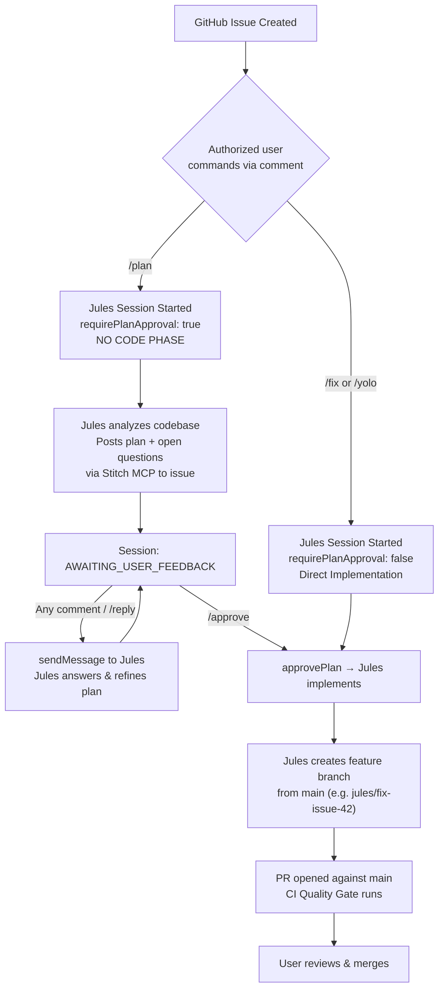

# Google Jules Issue Autofix Pipeline & Best Practice Workflow

## 1. Overview & Architecture

This workflow integrates **Google Jules** (Google Labs' autonomous cloud coding agent) into LocalGameGalaxy. The default path is **Plan → Approve → Implement** on a feature branch targeting `main`.


```mermaid
flowchart TD
    Issue["GitHub Issue Created"] --> Trigger{"Authorized user\ncommands via comment"}
    
    Trigger -->|/plan| PlanSession["Jules Session Started\nrequirePlanApproval: true\nNO CODE PHASE"]
    PlanSession --> JulesAnalyzes["Jules analyzes codebase\nPosts plan + open questions\nvia Stitch MCP to issue"]
    JulesAnalyzes --> Waiting["Session: AWAITING_USER_FEEDBACK"]
    Waiting -->|"Any comment / /reply"| SendMsg["sendMessage to Jules\nJules answers & refines plan"]
    SendMsg --> Waiting
    Waiting -->|"/approve"| ApprovePlan["approvePlan → Jules implements"]
    
    Trigger -->|"/fix or /yolo"| DirectFix["Jules Session Started\nrequirePlanApproval: false\nDirect Implementation"]
    DirectFix --> ApprovePlan
    
    ApprovePlan --> FeatureBranch["Jules creates feature branch\nfrom main (e.g. jules/fix-issue-42)"]
    FeatureBranch --> PRCI["PR opened against main\nCI Quality Gate runs"]
    PRCI --> UserMerge["User reviews & merges"]
```

---

## 2. Prerequisites & Setup

### A. Jules API Keys (Key Pool)
1. Visit [jules.google.com](https://jules.google.com) and authenticate with your GitHub account.
2. In your Jules account settings, generate an API Key.
3. In your GitHub repository: **Settings → Secrets and variables → Actions**
   - Create secret **`JULES_API_KEY`** (primary key)
   - Optionally add **`JULES_API_KEY_1`** through **`JULES_API_KEY_5`** for load-balancing

### B. Gemini API Key (UX Scanner)
- Optional: Add **`GEMINI_API_KEY`** (from [Google AI Studio](https://aistudio.google.com)) for the scheduled UX suggestion scanner.

### C. Connected MCP Servers
Jules uses:
- **`Stitch`** — GitHub MCP: Jules posts plan comments and interacts with the issue directly
- **`Context7`** — Repository context and documentation lookup

---

## 3. How to Trigger Jules

Only repository **Owners, Members, and Collaborators** can trigger Jules.

### Slash Commands (Issue Comments)

| Command | Action |
| :--- | :--- |
| **`/plan`** | Starts Jules in **Plan Mode** (`requirePlanApproval: true`). Jules analyzes the codebase and posts its plan + open questions as a GitHub comment. No code is written. |
| **`/approve`** or **`/continue`** | Approves Jules' plan. Jules begins implementation on a feature branch. |
| **`/fix`** | Fast-track: Jules implements directly without the plan-approval phase. |
| **`/yolo`** | Maximum autonomy: Jules implements immediately with zero confirmations. |
| **`/reply <message>`** | Sends custom feedback or answers to the active Jules session. |
| **`/status`** | Fetches the current Jules session state and last activities into a comment. |
| **`/jules lens <lens-id>`** | Runs a specialized RepoLens audit (e.g. `/jules lens separation-of-concerns`). |

> [!TIP]
> While Jules is in **AWAITING_USER_FEEDBACK** state, you can just type a normal comment — it will be forwarded to Jules automatically. Use `/approve` or `/continue` when you are satisfied with the plan.

### GitHub Labels

| Label | Action |
| :--- | :--- |
| `jules:plan` or `jules` or `plan` | Same as `/plan` |
| `jules:approved` or `approved` | Same as `/approve` — starts implementation |
| `jules:fix` or `fix` | Same as `/fix` |
| `yolo` or `jules:yolo` | YOLO mode |
| `lens:<name>` | RepoLens audit with specified lens |

### Manual Workflow Dispatch

1. Go to **Actions** → **Jules Suggestions**
2. Click **Run workflow**:
   - Scope: `Issue-AutoFix` or `Design` (UX scanner)
   - Mode: `plan`, `fix`, or `yolo`
   - Issue Number: the target issue

---

## 4. The Plan → Approve → Implement Flow

1. **`/plan`** → Jules session created with `requirePlanApproval: true`
2. **Jules analyzes**: Reads the issue, inspects relevant source files, checks AGENTS.md constraints
3. **Jules posts plan**: Via Stitch MCP (`gh issue comment`), Jules adds a structured plan comment with:
   - Files it intends to change
   - Architectural decisions
   - Any open questions for the developer
4. **Developer reviews**: Read the plan in the issue. Ask questions by commenting (forwarded to Jules via `sendMessage`).
5. **`/approve`** → `approvePlan` API call → Jules starts implementing
6. **Feature branch created** automatically (e.g. `jules/fix-issue-42`)
7. **PR opened** against `main` → CI quality gates run

---

## 5. Message Relay During Active Sessions

While Jules is active on an issue:
- Any authorized plain-text comment is forwarded to Jules via `sendMessage`
- The `interact-jules` job handles `/reply`, `/continue`, `/approve`, `/yolo`, `/status` commands
- Jules answers questions by posting comments via Stitch MCP
- Monitor detailed progress at `jules.google.com/task/<sessionId>`

---

## 6. Feature Branch & PR Flow

- Jules always creates a **feature branch** from `main` (auto-named: `jules/fix-issue-<id>`)
- PR targets `main`
- CI quality gates run on the PR (see [ci-cd-pipelines.md](ci-cd-pipelines.md))
- If a reviewer requests changes → `jules-pr-auto-fixer.yml` spawns Jules to fix (max 3 attempts)
- Developer merges the approved PR

---

## 7. RepoLens Audit Lenses

In any issue, comment:
```text
/jules lens <lens-id>
```

**Popular lenses:**
- **Architecture:** `separation-of-concerns`, `module-boundaries`, `circular-deps`
- **Performance:** `algorithm`, `memory`, `frontend-perf`
- **Testing:** `unit-test-gaps`, `edge-cases`, `error-path-tests`
- **Security:** `injection`, `xss-csrf`, `auth-session`
- **Android:** `secrets-in-apk`, `webview-security`
