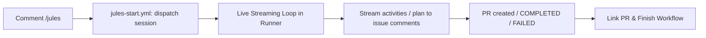

# Google Jules Streaming Pipeline

```mermaid
flowchart LR
  A["Comment /jules"] --> B["jules-start.yml: dispatch session"]
  B --> C["Live Streaming Loop in Runner"]
  C --> D["Stream activities / plan to issue comments"]
  D --> E["PR created / COMPLETED / FAILED"]
  E --> F["Link PR & Finish Workflow"]
```

## Behaviour

- **Trigger**: comment starting with `/jules` by OWNER/MEMBER/COLLABORATOR, or manual dispatch with `issue_number`.
- **Prompt**: Task description with issue title + body and instructions to link `Fixes #<number>`.
- **Session**: `requirePlanApproval: false`, `automationMode: AUTO_CREATE_PR`, branch `main`.
- **Fire & Forget**: The workflow dispatches the Jules session, posts the direct task tracking link (`https://jules.google.com/task/<id>`) to the issue, and finishes immediately (< 10 seconds), conserving GitHub runner minutes.
- **Completion**: Jules works in the background and opens the Pull Request with `Fixes #<number>` automatically. Real-time progress is viewed directly on Google Jules.

## Secret

`JULES_API_KEY` and/or `JULES_API_KEY_*` (rotation by issue number, fallback to next key).

---

## Declarative Scheduled Agents (`.github/agents/`)

Autonomous agents can run on a schedule (e.g. weekly security audit) and automatically deliver Pull Requests:

1. Define each agent as a markdown file with YAML frontmatter in `.github/agents/<id>.md` (e.g. `security.md`).
2. Set `schedule: monday` (or any weekday / `daily`) and `enabled: true`.
3. The orchestrator workflow (`.github/workflows/jules-audit.yml`) triggers `scripts/pipeline/jules-agent-runner.cjs`.
4. The runner creates an audit tracking issue and dispatches Jules with direct streaming. Jules inspects the codebase, applies fixes, and opens a Pull Request linked to the issue (`Fixes #...`).
