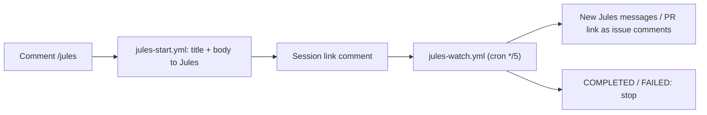

# Google Jules Minimal Pipeline

```mermaid
flowchart LR
  A["Comment /jules"] --> B["jules-start.yml: title + body to Jules"]
  B --> C["Session link comment"]
  C --> D["jules-watch.yml (cron */5)"]
  D --> E["New Jules messages / PR link as issue comments"]
  D --> F["COMPLETED / FAILED: stop"]
```

## Behaviour
- **Trigger**: comment starting with `/jules` by OWNER/MEMBER/COLLABORATOR, or manual dispatch with `issue_number`.
- **Prompt**: `# <title>` + issue body. Nothing else; Jules reads `AGENTS.md` from the repo.
- **Session**: `requirePlanApproval: false`, `automationMode: AUTO_CREATE_PR`, branch `main`.
- **State**: label `jules:active` (set on start, removed on finish) tells the watcher which issues to poll; the session link comment and hidden `<!-- jules:<id> -->` markers hold the rest.
- **Watcher**: scripts [`jules-start.cjs`](../../scripts/pipeline/jules-start.cjs) and [`jules-watch.cjs`](../../scripts/pipeline/jules-watch.cjs). Posts each new agent message once, the PR link, and stops at `COMPLETED`/`FAILED`.

## Secret
`JULES_API_KEY` and/or `JULES_API_KEY_*` (rotation by issue number, fallback to next key; key name stored in the session comment).

---

## Declarative Scheduled Agents (`.github/agents/`)

Autonomous agents can run on a schedule (e.g. weekly security audit) and automatically deliver Pull Requests:
1. Define each agent as a markdown file with YAML frontmatter in `.github/agents/<id>.md` (e.g. `security.md`).
2. Set `schedule: monday` (or any weekday / `daily`) and `enabled: true`.
3. The orchestrator workflow (`.github/workflows/jules-audit.yml`) triggers `scripts/pipeline/jules-agent-runner.cjs`.
4. The runner creates an audit tracking issue and dispatches Jules. Jules inspects the codebase, applies fixes, and opens a Pull Request linked to the issue (`Fixes #...`).
5. `jules-watch.yml` tracks the session and cleans up the active label upon PR delivery.

