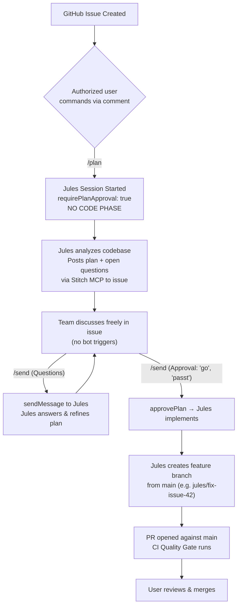

# Google Jules Issue Autofix Pipeline & Best Practice Workflow

## 1. Overview & Architecture

This workflow integrates **Google Jules** (Google Labs' autonomous cloud coding agent) into LocalGameGalaxy. The default path is **Plan → Approve → Implement** on a feature branch targeting `main`.


```mermaid
flowchart TD
    Issue["GitHub Issue Created"] --> Trigger{"Authorized user\ncommands via comment"}
    
    Trigger -->|/plan| PlanSession["Jules Session Started\nrequirePlanApproval: true\nNO CODE PHASE"]
    PlanSession --> JulesAnalyzes["Jules analyzes codebase\nPosts plan + open questions\nvia Stitch MCP to issue"]
    JulesAnalyzes --> Discussing["Team discusses freely in issue\n(no bot triggers)"]
    Discussing -->|"/send (Questions)"| SendMsg["sendMessage to Jules\nJules answers & refines plan"]
    SendMsg --> Discussing
    Discussing -->|"/send (Approval: 'go', 'passt')"| ApprovePlan["approvePlan → Jules implements"]
    
    ApprovePlan --> FeatureBranch["Jules creates feature branch\nfrom main (e.g. jules/fix-issue-42)"]
    FeatureBranch --> PRCI["PR opened against main\nCI Quality Gate runs"]
    PRCI --> UserMerge["User reviews & merges"]
```

---

## 2. Prerequisites & Setup

### A. Jules API Keys (Key Pool)
1. Visit [jules.google.com](https://jules.google.com) and authenticate with your GitHub account.
2. In your Jules account settings, generate an API Key.
3. In your GitHub repository: **Settings → Secrets and variables → Actions**
   - Create secret **`JULES_API_KEY`** (primary key)
   - Optionally add **`JULES_API_KEY_1`** through **`JULES_API_KEY_5`** for load-balancing

### B. Gemini API Key (UX Scanner)
- Optional: Add **`GEMINI_API_KEY`** (from [Google AI Studio](https://aistudio.google.com)) for the scheduled UX suggestion scanner.

### C. Connected MCP Servers
Jules uses:
- **`Stitch`** — GitHub MCP: Jules posts plan comments and interacts with the issue directly
- **`Context7`** — Repository context and documentation lookup

---

## 3. How to Trigger Jules

Only repository **Owners, Members, and Collaborators** can trigger Jules.

### Slash Commands (Issue Comments)

| Command | Action |
| :--- | :--- |
| **`/plan`** | Starts Jules in **Plan Mode** (`requirePlanApproval: true`). Jules analyzes the codebase and posts its plan + open questions as a GitHub comment. No code is written. |
| **`/send`** | Forwards recent team discussion since Jules' last message (formatted simply as `User: text`) to Jules without wrappers. If the discussion contains approval (e.g. `go`, `passt`, `approved`, `start`), Jules automatically begins implementation! Otherwise, Jules answers questions and refines the plan. |

> [!TIP]
> Developers can discuss freely in the issue without triggering Jules on every comment. When you are ready to forward the discussion to Jules (whether to ask questions or to say "go"), just comment `/send` (or add label `jules:send-messages`).

### GitHub Labels & State Lifecycle (Mutex Rule)

Strictly **one** `jules:*` label exists on an issue at any time. When a new state is reached, older Jules labels are automatically pruned:

| Label | Meaning & Transition |
| :--- | :--- |
| **`jules:in-progress`** | Jules is actively working (analyzing/planning or implementing). Set on `/plan` dispatch and whenever discussion is forwarded via `/send`. |
| **`jules:waiting`** | Jules has posted its plan or a clarifying question and is waiting for team feedback. Replaces `jules:in-progress`. |
| **`jules:send-messages`** | Trigger label: adding this label acts identically to commenting `/send`. It forwards recent discussion, purges older labels, and sets `jules:in-progress`. |
| *(None / cleared)* | Once Jules creates the Pull Request, all `jules:*` labels are stripped from the issue and the PR is linked directly in a completion comment. |

### Manual Workflow Dispatch

1. Go to **Actions** → **Jules Suggestions**
2. Click **Run workflow**:
   - Scope: `Issue-AutoFix` or `Design` (UX scanner)
   - Mode: `plan`, `fix`, or `yolo`
   - Issue Number: the target issue

---

## 4. The Plan → Approve → Implement Flow

1. **`/plan`** → Jules session created with `requirePlanApproval: true` → issue label set to `jules:in-progress`.
2. **Jules analyzes & plans**: Jules inspects relevant source files and posts its plan via Stitch MCP.
3. **Watcher detects plan**: Fast-path or scheduled watcher switches label to `jules:waiting`.
4. **Developer reviews & discusses**: Team discusses freely in comments without triggering the bot.
5. **Forwarding / Approval**: Commenting `/send` (or adding label `jules:send-messages`):
   - If discussion contains approval (e.g. `go`, `passt`, `approved`), Jules starts coding immediately!
   - If discussion contains questions, Jules answers and refines the plan.
   - Label switches back to `jules:in-progress`.
6. **Completion**: Jules creates a feature branch targeting `main` and opens a PR. Watcher strips all `jules:*` labels from the issue and posts the PR link!

---

## 5. Message Relay During Active Sessions

While Jules is active on an issue:
- Developers discuss freely without each comment pinging Jules.
- When ready, maintainers comment `/send` (or `/send-messages` or add label `jules:send-messages`).
- The pipeline batches all comments since Jules' last message cleanly (`Here is the discussion since your last message:\n\nUser: text`) without any wrapper boilerplate.
- Jules answers questions by posting comments via Stitch MCP.
- Monitor detailed progress at `jules.google.com/task/<sessionId>`.

---

## 6. Feature Branch & PR Flow

- Jules always creates a **feature branch** from `main` (auto-named: `jules/fix-issue-<id>`)
- PR targets `main`
- CI quality gates run on the PR (see [ci-cd-pipelines.md](ci-cd-pipelines.md))
- If a reviewer requests changes → `jules-pr-auto-fixer.yml` spawns Jules to fix (max 3 attempts)
- Developer merges the approved PR

---

## 7. RepoLens Audit Lenses

In any issue, comment:
```text
/jules lens <lens-id>
```

**Popular lenses:**
- **Architecture:** `separation-of-concerns`, `module-boundaries`, `circular-deps`
- **Performance:** `algorithm`, `memory`, `frontend-perf`
- **Testing:** `unit-test-gaps`, `edge-cases`, `error-path-tests`
- **Security:** `injection`, `xss-csrf`, `auth-session`
- **Android:** `secrets-in-apk`, `webview-security`
